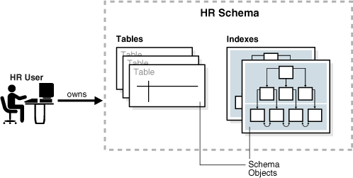
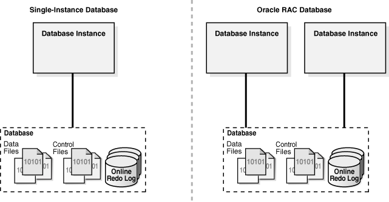
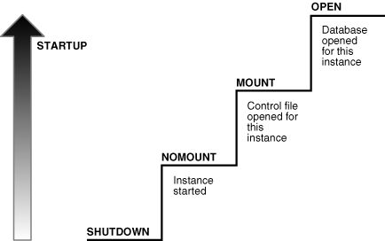
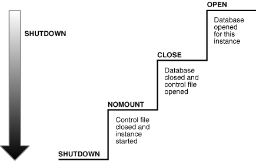

# 前言

参考资料:

[Oracle官方文档](https://docs.oracle.com/en/database/oracle/oracle-database/index.html)

# Schema

Schema是表, 索引, 存储过程等等数据库对象的存储容器

用户与Schema之间是**一对一**的关系

例如: 访问用户A的xxx对象就通过 `A.xxx`

# Oracle 表空间

表空间是逻辑上, 存放数据表的容器

每张表一定属于某个表空间

每个用户(Schema)可以拥有多个表空间, 而且都有一个默认表空间

用户之间可以通过共享表空间的方式共享数据表

物理上, 表空间的存储可能不是连续的

# PL/SQL

- A primary benefit of PL/SQL is the ability to store application logic in the database itself.

# Oracle 体系结构 (重要)

- Oracle Server = Oracle Instance + Oracle Database

## 1. Oracle实例 (Oracle Instance)

Oracle Instance = SGA(system global area) + Background Process

是一组**OS进程(线程)和一些内存(SGA)**的总称

可以用来mount和open一个数据库

一个实例在其生存期中最多只能装载和打开一个数据库。要想再打开这个（或其他）数据库，必须先丢弃这个实例，并创建一个新的实例。

一个数据库实例的状态分为以下几种

- `started`

- `mounted`

- `open`

- `close`

- `mounted`

- `open`

### `started` 状态

在执行`startup nomount`命令后, Oracle会执行以下操作, 之后实例会进入`started`状态, 此时实例还未绑定数据库

- 读取配置文件

- 分配`SGA`

- 启动后台进程

- 打开一些用于记录的文件

### `mounted` 状态

在执行`startup mount`或者`alter database mount`命令后, 实例会进入`mounted`状态, 对应数据库的open_mode也是`mounted`。

数据库打开后, 执行`alter database close`命令后, 实例也会进入`mounted`状态, 对应数据库的open_mode也是`mounted`。

此时实例与数据库建立了联系, 但是只有DBA能够访问数据库。

### `open` 状态

在执行`startup`或者`alter database open`命令后, 实例会进入`open`状态。

此时实例与数据库建立了联系, 数据库完全启动, 普通用户也可以访问数据库。

## 2. Oracle数据库 (Oracle Database)

Oracle Database = Controlfile + datafile + logfile + spfile + ...

是存储在**磁盘**上的**一组数据文件**的集合

一般来说, 一个数据库上只有一个实例对其进行操作

但是也有例外: RAC（Real Application Clusters）就允许在集群环境中的多台计算机上操作，这样就可以有多台实例同时装载并打开一个数据库（位于一组共享物理磁盘上）

例外2: 容器式数据库

## 3. *Oracle数据库*和*Oracle实例*的关系

1. 一个实例一生只能够装载及打开一个数据库  

2. 一个数据库能够被多个实例装载并打开(RAC)

3. 每个运行着的数据库一定与至少一个实例关联

Oracle数据库与实例的启动过程

Oracle数据库与实例的关闭过程

# 常用命令

- 名称, 版本信息查看

    - 查询数据库版本信息

        `SQL> select * from v$version;`
        
    - 查看数据库名称

        `SQL> show parameter db_name;`
        
    - 查看数据库服务名

        `SQL> show parameter service_names;`

    - 查询全局数据库名称

        `SQL> select * from global_name;`

- 数据库实例 (Instance)

    - 查询当前数据库实例名称

        `SQL> select instance_name from v$instance;`
        
    - 查看数据库实例状态(open/mount等)

        `SQL> select status from v$instance;`
        
    - 查看数据库实例启动时间

        `SQL> SELECT TO_CHAR(STARTUP_TIME,'MON-DD-RR HH24:MI:SS') AS "Inst Start Time" FROM V$INSTANCE;`

    - 创建一个新的数据库实例、加载数据库、打开数据库 (需要DBA权限)

        `SQL> startup [nomount | mount | open];`

    - 关闭实例绑定的数据库、卸载数据库、结束当前实例 (需要DBA权限)

        `SQL> shutdown [normal | transactional | immediate];`

    - 关闭实例绑定的数据库、卸载数据库

        `SQL> alter database close;`

    - 加载数据库/打开数据库

        `SQL> alter database [mount | open];`

- 数据库设置, 统计信息等

    - 查询数据库打开模式(mounted/open/read write)

        `SQL> select open_mode from v$database;`

    - 查看数据库DBF文件位置

        `SQL> select name from v$datafile;`

    - 查询数据文件状态

        `SQL> select file#,name,status,enabled,checkpoint_change# from v$datafile;`

    - 查询数据文件位置

        `SQL> select name from v$datafile;`

    - 查询数据文件（表空间）大小

        `SQL> select sum(bytes)/1024/1024/1024 as GB from v$datafile;`

    - 查询有效数据大小

        `SQL> select sum(bytes)/1024/1024/1024 as GB from dba_segments;`

    - 查看当前库的所有数据表

        `SQL> select TABLE_NAME from all_tables;`

- 可插拔数据库 (PDB) 管理

    - 查看数据库是CDB还是传统DB

        `SQL> select name, cdb, open_mode, con_id from v$database;`

    - 查看当前容器 (CDB) 名

        `SQL> show con_name;`

    - 列举当前容器中的所有PDB

        `SQL> select con_id, dbid, guid, name, open_mode from v$pdbs;`

    - 切换到某个PDB

        `SQL> alter session set container=<PDB>;`

    - 启动PDB数据库

        `SQL> alter pluggable database <PDB> open;`

        或者

        `SQL> alter session set container=<PDB>;`
        `SQL> startup`

    - 关闭PDB数据库

        `SQL> alter pluggable database <PDB> close;`

- 用户管理

    - 创建用户
