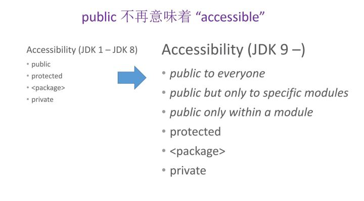

# Java 包(Package), Jar和模块(Module)的区别

- 包 (Package)

    - 是Java源文件的集合, 包含Class/Interface/Annotation的定义

    - 与文件系统中的目录对应

    - 主要目的是*防止命名冲突*

- Jar (Java Archive File)

    - 是编译后的Java代码(`.class`)的压缩包

    - 实际上是一个zip格式文件

    - 对Jar的操作用`jar`命令, 其语法类似Linux下的`tar`

        - 创建Jar包: `jar cvf test.jar test`

        - 解压Jar包: `jar xvf test.jar`

        - 列举Jar包的内容: `jar tvf test.jar`

- 模块 (Module)

    - 是Java语言内置的一种管理组件之间依赖关系的方法, 在Java 9被引入

    - Module 解决的问题:

        - 在Java 9之前, **主要使用package作为封装方式，使用Jar作为模块, 封装方式由 package和访问修饰符 (private, protected, public,包私有) 控制**

            - 任何模块都能访问其他模块的public的代码，不同Jar下的同名包可以相互访问包私有的代码。
            
            - 无法控制非平台开发者对平台内部包的访问，如应用代码可以访问sun.misc、com.sun.security这样和具体平台绑定的包。
            
            - 没有明确的依赖信息，模块开发者无法设置必须的依赖，模块使用者不清楚该模块必须依赖哪些模块。只能使用外部的工具，如Maven、Gradle、OSGI等。

    - Module 的优势

        - 明确的依赖配置，JPMS会在编译和运行之前检查当前环境是否满足依赖的要求。JPMS会检查版本冲突，即当有两个模块暴露了相同的包名时，系统会抛出异常。JPMS支持传递性依赖。
        
        - 强大的封装，模块可以明确指定哪些包能暴露给哪些模块，JPMS不允许代码使用反射的方式访问不对外开放的包。
        
        - 性能优化，JPMS完全清楚哪些模块是需要的，所以不需要的模块不会被JVM载入。

    - Module 的不足:

        - 缺乏对模块的版本的支持

    - 特点:
    
        

# Linux (Ubuntu) 硬件管理

- 通用

    - `lshw -short`: 列举所有硬件信息

- CPU

    - `lscpu`: 查看CPU信息

    - `cat /proc/cpuinfo`: 查看每个CPU的信息

- 内存

    - `free [-m|-g|-k|-b|-h]`: 查看内存使用情况

    - `cat /proc/meminfo`: 查看内存详细使用情况

    - `dmidecode -t memory`: 查看内存硬件信息

- 硬盘

    - `lsblk`: 查看硬盘和分区信息

    - `fdisk -l`: 查看详细分区表

    - `df -h`: 查看硬盘剩余空间

- 主板 BIOS

    - `dmidecode -t bios`: 查看bios信息

- PCI设备

    - `lspci`

- 网卡

    - `lspci | grep -i 'Ethernet'`: 查看网卡硬件信息 (Ethernet 以太网)

    - `lspci | grep -i 'Wireless'`: 查看无线网卡硬件信息

    - `ifconfig -a`: 查看系统的所有网络接口

- USB 设备

    - `lsusb`

# apt remove 与 apt purge 的区别

- purge会删除配置文件, 而remove只会删除程序文件

# Java 学习

- Java多线程

    - interrupt() 向该进程发送中断信号, 具体怎么处理由该进程实现
