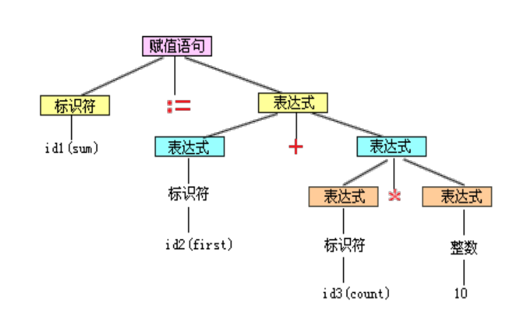
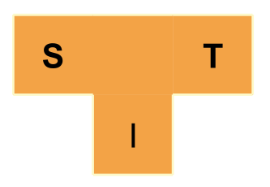
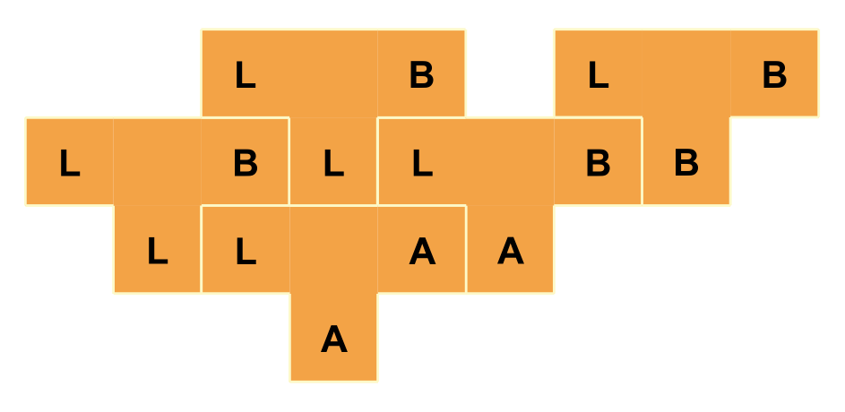

## 课程简介

总评 = 考试 * 60% + 作业 * 30% + 平时 * 10%

## 程序语言的发展

机器语言 -> 汇编语言 -> 高级语言

## 程序的两种执行方式

- 解释方式

- 编译方式

Java认为是解释型语言

## 编译的步骤

编译过程基本分为五个基本阶段: 
1. 词法分析
2. 语法分析
3. 语义分析和中间代码生成
4. 优化
5. 目标代码生成

### 1. 词法分析

* 词法分析程序又称扫描程序(Scanner)。
    - 任务：读源程序的字符流、识别单词（也称单词符号，或简称符号），如标识符、关键字、常量、界限符等，并转换成内部形式。
    - 输入：源程序中的字符流
    - 输出：等长的内部形式，即属性字（单词类型Token-name, 单词属性Attribute-value），其中单词属性指向符号表

输入: 字符流
```js
cppcode = `
int a, b;
a = a + 2;
`
```
输出: Token流和对应的符号表
```js
tokenList = [
    <int>
    <id,1>
    <,>
    <id,2>
    <;>
    <id,1>
    <op,EQ>
    <id,1>
    <+>
    <2>
    <;>
]
tokenTable = [
    {name: 'a', ...},
    {name: 'b', ...} 
]
```

* 在词法分析阶段工作所依循的是语言的词法规则。
* 描述词法规则的有效工具是**正规式**和**有限自动机**。
* 方法：**状态图**；**DFA**；**NFA**

DFA模拟代码：
```c++
s = s0;
c = nextChar() ;
while ( c != eof ) {
    s = move(s, c);
    c = nextChar() ;
}
if ( s is in F ) return " yes " ;
else return "no " ;
```

### 2. 语法分析

* 语法分析程序又称识别程序(Parser)。
    - 任务：读入由词法分析程序识别出的符号，根据给定语法规则，识别出各个语法单位（如：短语、子句、语句、程序段、程序）,并生成另一种内部表示。
    - 输入：由词法分析程序识别出并转换的符号
    - 输出：另一种内部表示，如**语法分析树**或其它**中间表示**。
* 语法规则通常用**上下文无关文法**描述。
* 方法：递归子程序法、**LR分析法**、**算符优先分析法**。

输入: 符号流
```js
sum := first + count * 10
```
输出: 语法树


### 3.1 语义分析

### 3.2 中间代码生成

### 4. 优化

* 优化的任务在于对前段产生的中间代码进行加工，把它变换成功能相同，但功效更高的优化了的中间表示代码，以期在最后阶段产生更为高效（省时间和空间）的代码
* 优化所依循的原则是程序的等价变换规则
* 其方法有：公共子表达式的提取、循环优化、删除无用代码等等。

### 5. 目标代码生成

### 遍(Pass)

对**源程序**或源程序的**中间结果**从头到尾扫描一次，并做相关处理，生成新的中间结果或目标程序的过程。

“遍”是处理数据的一个完整周期，每遍工作从外存上获得前一遍的中间结果（如源程序），完成它所含的有关工作之后，再把结果记录于外存。

一个编译程序可由一遍、两遍或多遍完成。每一遍可完成不同的阶段或多个阶段的工作。

|          | 从时间和空间角度看     |
| -------- | ---------------------- |
| 多遍编译 | **少占内存，多耗时间** |
| 一遍编译 | **多占内存，少耗时间** |

### T形图



- S:源语言(程序)，Source language(program)
- T:目标语言(程序), target/object language(program)
- I:实现语言, implementation language

用T形图表示编译器移植



### 特殊

自编译: 

交叉编译

自动编译: 
    lex, yacc

## 复习

乔姆斯基文法:
0/1/2/3

词法分析: 3型
语法分析: 2型

A卷 - 简单
缓考不考->B卷->难

语法分析:
LR,SLR,二义文法

就5道大题 5个部分 占40%
平时 60%

