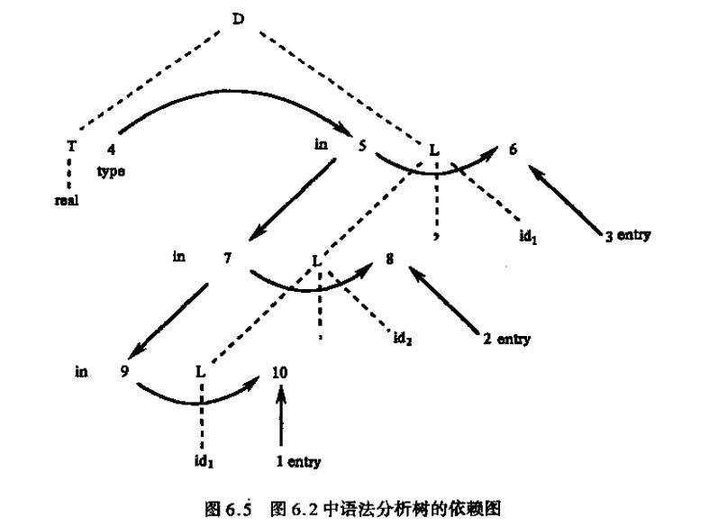
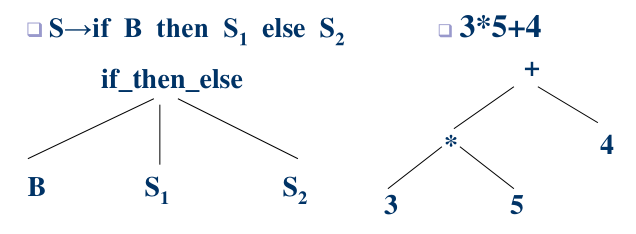
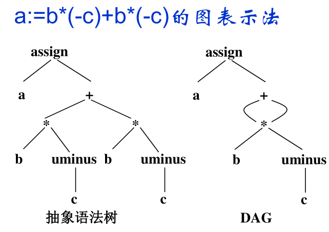
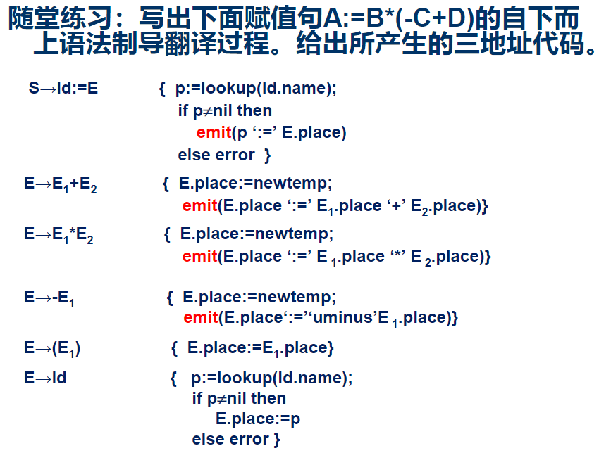
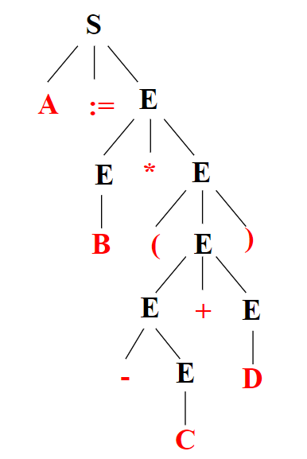
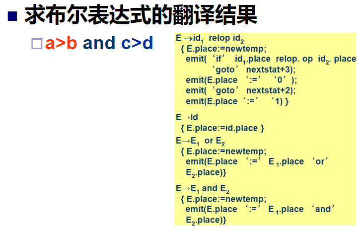

# 属性文法和语法制导翻译

## 属性文法

属性文法: 在上下文无关文法的基础上给每个文法符号增加若干属性

语义规则: 对于文法的每个产生式配备了**一组**属性的计算规则
- $b:=f(c_1,c_2,...,c_k)$
- 产生式左边的综合属性和右边的继承属性必须提供语义规则
- 语义规则所描述的工作可以包括属性计算、符号表操作、静态语义检查、代码生成等等。

属性加工的过程即是语义处理的过程

属性
- 综合属性: 在语法树中, 通过子节点的属性计算出来的属性(自下而上)
- 继承属性: 在语法树中, 通过父节点和兄弟节点的属性计算出来的属性(自上而下)
- 终结符只有综合属性, 有lexer提供

### S-属性文法

只包含综合属性的文法

### L-属性文法

如果每个产生式A→X1…Xj-1Xj…Xn的每条语义规则计算的属性或者是A的综合属性；或者是Xj的继承属性，但它仅依赖：
- 该产生式中Xj左边符号X1, X2, …, Xj-1的属性；
- A的继承属性


## 语法制导翻译

语法制导翻译法: 
- 基于属性文法的处理过程: `输入串->语法树->依赖图->语义规则计算次序`
- 由源程序的语法结构所驱动

作用
- **产生中间代码**
- 产生目标指令
- 对输入串进行解释执行

### 依赖图

用DAG表示属性依赖关系
- 每个属性一个结点
- 语义规则中左边属性依赖右边每一个属性



1. 树遍历法
   - 无环图
   - DFS
   - 从左到右

2. 一遍扫描法
   - 在语法分析的同时计算属性值
   - S-属性文法适合于一遍扫描的自下而上分析
   - L-属性文法适合于一遍扫描的自上而下分析

# 语义分析和中间代码生成

## 语义分析


## 中间语言

中间语言是复杂性界于源语言和目标语言之间的语言

好处:
* 便于进行与机器无关的代码优化工作
* 易于移植
* 使编译程序的结构在逻辑上更为简单明确

常用的中间语言:
* 后缀式(逆波兰式)
* 图表示
  * DAG
  * AST
* 三地址代码
  * 三元式
  * 四元式
  * 间接三元式

后缀式:
- 二元操作符后置
- (一元操作符后置)
- 去括号

```
a+b*(c+d/e)
a b*(c+d/e) +
a b (c+d/e) * +
a b c d/e + * +
a b c d e / + * +
```

```
b:=-c*a+-c*a
b -c*a+-c*a :=
b -c*a -c*a + :=
b -c a * -c a * + :=
b c Neg a * c Neg a * + :=
```

抽象语法树: 去掉对翻译不必要的信息, 更有效表示源程序的语法树



DAG
- 一个内部结点代表一个操作符，它的孩子代表操作数
- 一个DAG中代表**公共子表达式**的结点具有多个父结点



三地址代码: `x:=y op z`
- 三地址代码可以看成是抽象语法树或DAG的一种线性表示
- 种类
  - `x:=y op z`
  - `x:=op y`
  - `x:=y`
  - `goto L`
  - `if x rop y goto L`
  - `if a goto L`
- 计算机表示
  - 四元式
    |     | Op     | arg1 | arg2 | result |
    | --- | ------ | ---- | ---- | ------ |
    | (0) | uminus | c    |      | T1     |
    | (1) | *      | b    | T1   | T2     |
    | ... | ...    | ...  | ...  | ...    |

  - 三元式
    |     | Op     | arg1 | arg2 |
    | --- | ------ | ---- | ---- |
    | (0) | uminus | c    |      |
    | (1) | *      | b    | (0)  |
    | ... | ...    | ...  | ...  |
    | (4) | +      | (1)  | (3)  |
    | ... | ...    | ...  | ...  |

  - 间接三元式
    - 使用间接代码表来压缩存储相同的三元式
    - 好处: 
      - 调整语句顺序不需要改动三元式表
      - 节省存储空间

## 说明语句的翻译

## 赋值语句的翻译



答案:



三地址代码
```
T1:=uminus C
T2:=T1+D
T3:=B*T2
A:=T3
```

## 布尔表达式的翻译

基本作用:
- 逻辑运算
- 控制语句条件

翻译方法
- 算数方式
- 短路计算
  
### 逻辑运算翻译



答案:

三地址代码
```
0: if a>b goto 3
1: T1:=0
2: goto 4
3: T1:=1
4: if a>b goto 7
5: T1:=0
6: goto 8
7: T1:=1
8: T3=T1 and T2
```

### 条件控制翻译


## 控制语句的翻译

## 过程调用的翻译

### 