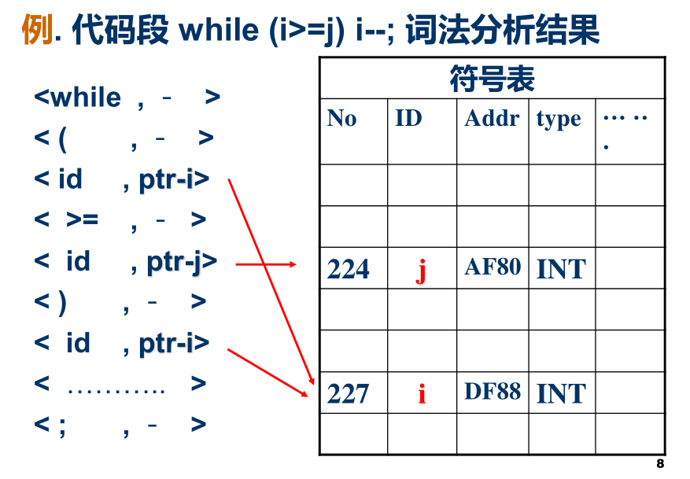
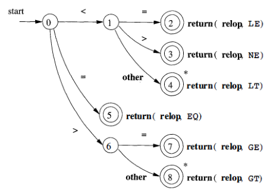
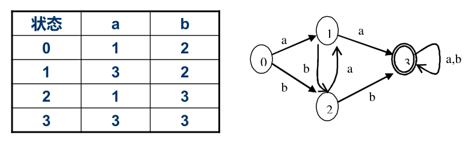
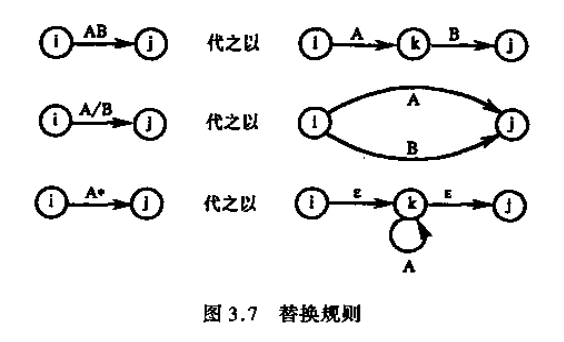

## 概述

- 单词级别分析和翻译源程序
- 任务: 作为**字符串**的源程序->**单词符号串**

## 词法分析器的要求

单词符号表示通常使用二元式 (单词种别, 单词符号的属性值)

- 单词种别: 语法分析需要的信息, 通常使用整数编码
- 单词(符号属性)值: 编译其他阶段使用

单词如何分类取决于处理上的方便:

- 标识符: 一般通归为一种
- 常数: 按类型分种
- 关键字: 可全体为一种, 也可一字一种(更方便)
- 运算符: 一般一符一种, 可以把具有一定共性的视为一类
- 界符: 一般一符一种

单词符号的属性:

- 标识符: 存放它**符号表**项的指针/内部字符串
- 常数: 存放它**常数表**项的指针/二进制形式
- 关键字/运算符/界符: 不需要属性



实现方式:
- 完全独立: lex作为单独一遍
  - 结构简洁, 清晰, 条理化
- 相对独立: 作为parser的一个独立子程序, 需要新符号时调用
  - 避免中间文件, 提高效率

## 词法分析器设计

### lexer的结构

源程序 -> 输入缓冲区/预处理子程序/扫描缓冲区/扫描器 -> 单词符号

预处理子程序: 处理空白符等编辑性字符, 删除注释等

输入缓冲区: 存放源程序文本输入串的缓冲区

扫描缓冲区: 设定两个指示器

### 单词符号的识别: 超前搜索

- 关键字识别
- 标识符识别: 一般是字母开头的字母数字串, 一般都跟着算符或者界符, 不难识别
- 常数的识别: 有些语言需要使用超前搜索
- 算符和界符: 对于c++中的++,--等需要超前搜索

### 词法规则的表示

大多数pl中的单词符号的**词法规则**可以用**正规文法**描述

例如:

```js
<标识符>→ 字母|<标识符>字母|<标识符>数字
<整数>→数字|<整数>数字
<运算符>→+|－|\times|÷…
<界符>→; |, |( | )|…
```

利用这些规则识别的过程可以用**状态转换图**来表示, 而状态转换图可以方便地用程序实现

### TG

状态转换图TG: 一个有限有向图, 可用于接受(识别)一定的符号串

- 结点表示状态, 用圆圈表示
  - 初态: 通常只有一个, 用一条输入弧表示
  - 终态: **至少有一个**, 用双圈表示
- 方向弧表示状态转换, 弧上的标记表示接受的输入字符或字符类

路: 在状态转换图中从初态到某一个终态的弧上的标记序列

接受(识别): 若存在一条路产生$\beta$, 则称状态转换图接受符号串$\beta$

状态转换图能识别的语言: L(TG)能别TG接受的符号串的集合



## 正规表达式和有限自动机

### 正规式和正规集

字母表$\Sigma$上的正规式和正规集递归定义如下：
1. $\varepsilon$和$\varphi$都是$\Sigma$上的正规式，它们所表示的正规集分别为$\{\varepsilon\}$和$\varphi$。其中：$\varepsilon$为空字符串，$\varphi$为空集
2. 任意元素$a\in\Sigma$，a是$\Sigma$上的一个正规式，它所表示的正规集是$\{a\}$;
3. 假定U和V都是$\Sigma$上的正规式，它们所表示的正规集记为L(U)和L(V)，那么（U|V），（U·V）和(U)\*都是正规式，他们所表示的正规集分别记为L(U)∪L(V)，L(U)L(V)和(L(U))\*。
4. 仅由有限次使用上述三步而得到的表达式才是$\Sigma$上的正规式，它们所表示的字集才是$\Sigma$上的正规集。

运算:
- 闭包`*`
- 连接`.` (可省略)
- 或`|`

运算律:
- 或交换律
- 或结合律
- 连接结合律
- 或对连接分配律
- $\varepsilon U=U \varepsilon=U$

例:
- 以01结尾的二进制数串的正规式: `(0|1)*01`
- 能被5整除的十进制整数: `0|5|(1|2|3|4|5|6|7|8|9)(0|1|2|3|4|5|6|7|8|9)*(0|5)`

### FA

自动机: 具有离散输入输出的数学模型

    状态 + 输入 + 规则 -> 状态迁移

有限自动机(FA)

有限状态机(FSM)

### DFA

DFA五元组: $M=(S,\Sigma,\delta,S_0,F)$
- S: 有限的状态集合，每个元素称为一个状态
- $\Sigma$: 有限的输入字母表，每个元素称为一个输入字符
- $\delta: S\times\Sigma → S$: 转换函数(状态转移集合)
  - $\delta(s, a)=s'$
- $S_0\in S$: 初始状态
- $F\subseteq S$: 终止状态集

状态转换矩阵: DFA可以用一个矩阵表示, 每行表示一个状态, 每列表示一种输入, 矩阵元素表示$\delta$(s,a)的值

**DFA与状态转换图: DFA可以用TG唯一表示**



**拓展转移函数**
- 接收一个字符串的状态转移函数
- $\delta': S\times\Sigma^* → S$
- 定义
  - $\delta'(s, \varepsilon) = s$
  - $\delta'(s, \omega a) = \delta(\delta'(s,\omega ),a)$

DFA接受的字符串

DFA接受的语言: $L(M)=\{α|\delta'(s,α)\in F\}$

### NFA

NFA五元组: $M=(S,\Sigma,\delta,S_0,F)$
- $S$: 同DFA
- $\Sigma$: 同DFA
- $\delta: S\times\Sigma^* → 2^S(幂集)$: 转换函数(状态转移集合)
  - $\delta(s, a)=S'\subseteq S$
- $S_0\subseteq S$: 非空初态集
- $F\subseteq S$: 终止状态集

**NFA也可以用TG和转换矩阵表示**

**NFA的状态是一个集合**

| 比较     | DFA                             | NFA                       |
| -------- | ------------------------------- | ------------------------- |
| 输入字母 | 每个(状态,输入)都有一个$\delta$ | 可能没有$\delta$/是空转换 |
| 转移状态 | 确定的                          | 不确定的, 可能有多个      |

NFA的拓展转移函数 $\delta'(\delta: S\times\Sigma^* → 2^S)$
1. $\delta'(s, \varepsilon) = \{\varepsilon\}$
2. $\delta'(s,\omega a)=\{p|存在r\in\delta'(s,\omega )\wedge p\in\delta(r,a)\}$


NFA接受的字符串

NFA接受的语言

### DFA和NFA的关系

DFA是NFA的特例, 两者可以相互转化

$\varepsilon-闭包:$
$$
\varepsilon\_CLOSURE(I)=\{q|q\in I\}\cup\{q'|q经任意条\varepsilon弧可到达q', q\in I\}, I\subseteq M'
$$

NFA->DFA之子集法:
1. 引进新的初态结点X和终态结点Y, 从X到任意结点连接一条$\varepsilon$弧, 从任意结点到Y连接一条$\varepsilon$弧
2. 对复合的弧进行分裂合并替换

     

3. 构造状态矩阵
    | I                           | $I_{\Sigma_i}$ |
    | --------------------------- | -------------- |
    | $\varepsilon\_CLOSURE({X})$ | ...            |
    | ...                         | ...            |

4. 合并相同状态, 重新命名得到新的状态转换矩阵
5. 画出状态转换图


## 词法分析器的自动生成