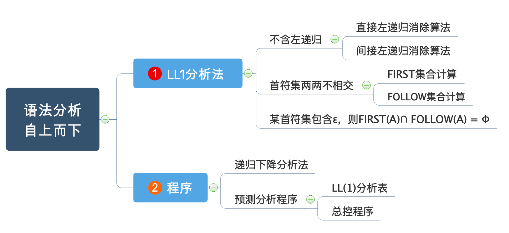
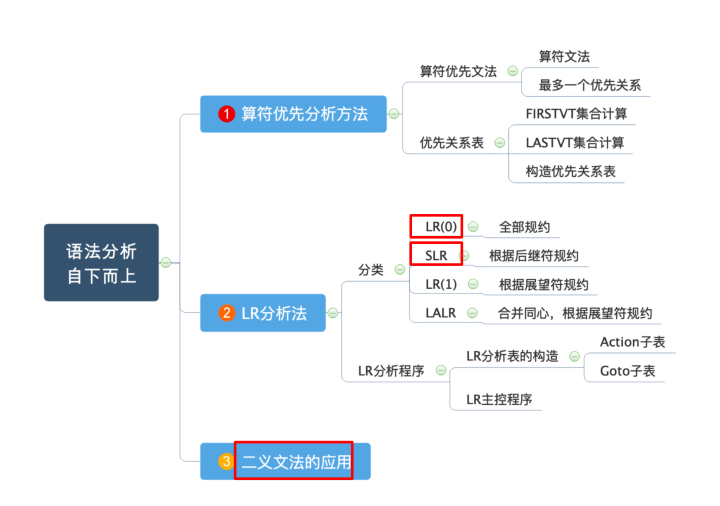
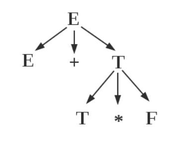
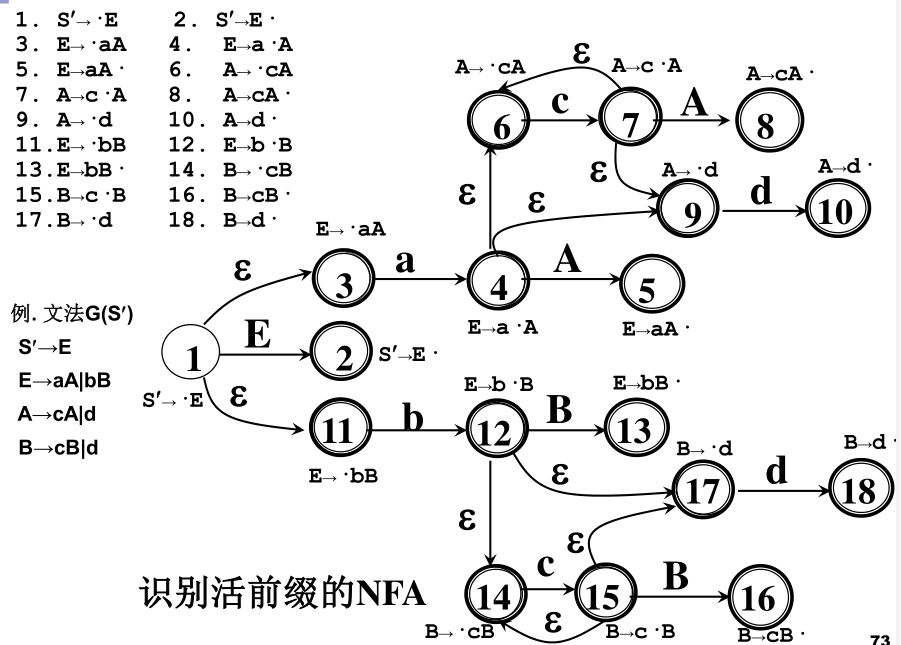
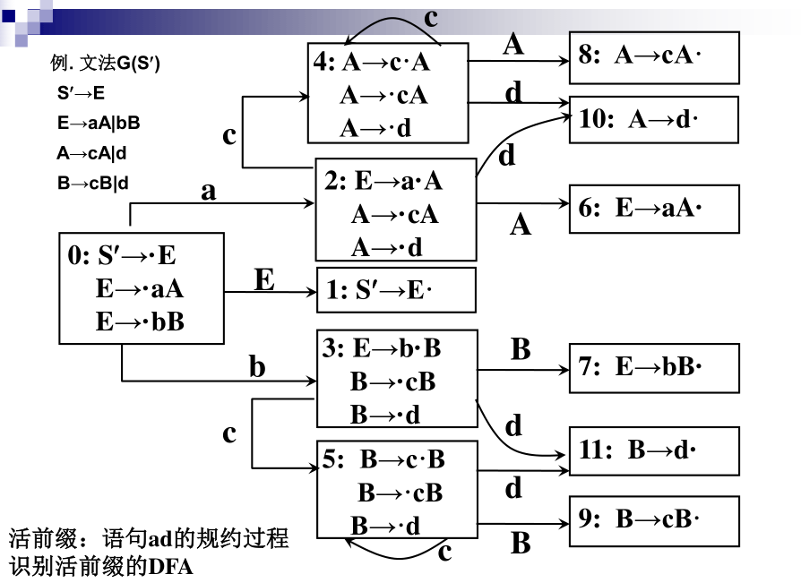
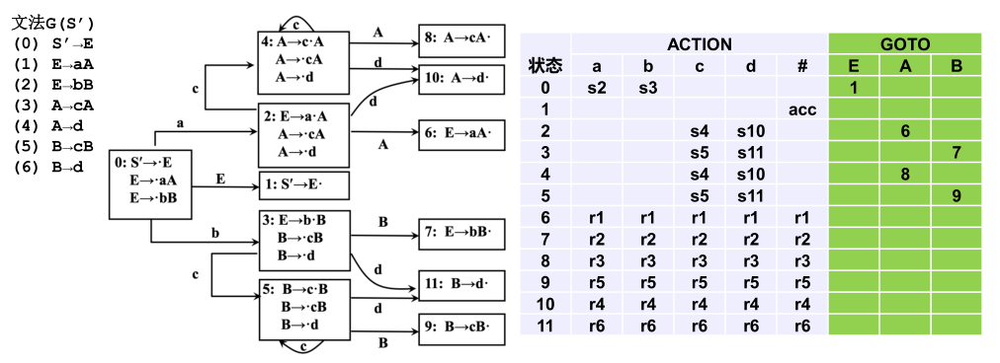

## 提纲





## 语法分析方法

- 自上而下分析
  - LL(1)分析法
  - 递归下降分析法
  - 预测分析法
- 自下而上分析
  - 算符优先分析法
  - LR分析法
    - LR(0)
    - SLR
    - LR(1)
    - LALR

## LL(1)

### 左递归消除

一个文法含有下列形式的产生式时, 称为左递归文法, 不能采用自顶向下分析法
1. 直接递归

    $A\rightarrow A\beta, A\in V_N$, $\beta$$\in$V*

2. 间接递归
    
    $A\rightarrow B\beta$
    
    $B\rightarrow A\alpha, A,B\in V_N, \alpha, \beta\in V^*$

**左递归消除**

$P\rightarrow P\alpha_1|P\alpha_2|...|P\alpha_m|\beta_1|\beta_2|...|\beta_n$

改写为

$P\rightarrow\beta_1 P'|\beta_2 P'|...|\beta_n P'$

$P'\rightarrow\alpha_1 P'|\alpha_2 P'|...|\alpha_m P'|\varepsilon$

### FIRST, FOLLOW

$终结首符集:FIRST(\alpha)=\{a|\alpha\Rightarrow^*a...,a\in V_T\}, \\特别地, 如果\alpha\Rightarrow^*\varepsilon, 则规定\varepsilon\in FIRST(\alpha)$

$后继终结符号集:FOLLOW(A)=\{a|S\Rightarrow^*...Aa...,a\in V_T\}, \\特别地, 如果S\Rightarrow^*...A, 则规定\#\in FIRST(S)$


### LL(1)文法

可以进行无回溯的自上而下分析
- 不含左递归
- 产生式右侧的所有非终结符的FIRST集无交集
  - $A\rightarrow\alpha_1|\alpha_2|...|\alpha_n\Rightarrow FIRST(\alpha_i)\cap FIRST(\alpha_j)=\Phi, (i\neq j)$
- 若$\varepsilon\in FIRST(A)$, 则$FIRST(A)\cap FOLLOW(A)=\Phi$

### LL(1)分析方法

- 当前输入符号为$a$, 要匹配一个$A$, 且$A\rightarrow\alpha_1|\alpha_2|...|\alpha_n$
- 若$a\in FIRST(\alpha_i$)集合, 则直接匹配$A\rightarrow\alpha_i$
- 若$\varepsilon\in FIRST(A)$, 但是$a\in FOLLOW(A)$中, 仍可以匹配
- 否则报错

### LL(1)程序构造

#### 递归下降程序

- 每个递归过程对应一个非终结符

#### 预测分析程序

使用分析表和符号栈实现LL(1)分析

需要预先构造分析表

略

## 规范规约

**短语**: 
- $对于文法G, 开始符号S, 若\alpha\beta\delta是一个句型, 如果S\Rightarrow^*\alpha A\delta且A\Rightarrow^+\beta, 则称\beta是句型\alpha\beta\delta相对于A的短语$
- $句型语法树中每棵子树的所有叶子结点左右到右排列起来构成一个该句型相对于子树根(A)的短语$

**直接短语**: 
- $A\Rightarrow\beta$
- $只有父子两代的子树形成的短语, 一步推导出终结符的子树$

**句柄**:
- $一个句型的最左直接短语$
- $语法树中最左的只有父子两代的子树形成的短语$



句型`E+T*F`的
- 短语为`E+T*F`(相对于E), `T*F`(相对于T)
- 直接短语为`T*F`
- 句柄为`T*F`

## 算符优先分析法

### 算符优先文法

算符文法: 任一产生式的右部都不包含两个**相继(并列)的非终结符**

最多一个优先关系: 对任何一对终结符, (a,b)最多满足一个优先关系

算符优先文法: 满足最多一个优先关系的算符文法

### 优先关系表

优先关系的表格

### FIRSTVT, LASTVT

$FIRSTVT(P)=\{a|P\Rightarrow^+a...或P\Rightarrow^+Qa..., a\in V_T而Q\in V_N\}$

$LASTVT(P)=\{a|P\Rightarrow^+...a或P\Rightarrow^+...Qa, a\in V_T而Q\in V_N\}$

### 素短语

素短语: 至少含有一个终结符, 而且除它自身以外不含有任何更小的素短语

最左素短语: 句型最左边的素短语

## LR分析法

L: 从左到右扫描输入串
R: 构造最右推导的逆过程
LR分析法是严格的规范规约

原理: 在移进-规约过程中寻找句柄

模型: 
- 将历史和展望抽象成状态, 整体上是一个FA
- 一张分析表
  - ACTION[s,a]: 状态s遇到输入a应该采取什么动作
  - GOTO[s,X]: 状态s遇到文法符号X时下一状态是什么, 构成了一个以文法符号为字母表的DFA

分类:
- 总控程序: 所有的LR分析器都相同
- 分析表: 是自动生成语法分析器的关键
  - LR(0)表: 基础但有局限性
  - SLR表: 简单LR表, 实用
  - 规范LR表: 能力强, 代价大
  - LALR表: 向前LR表, 介于SLR和规范LR之间

ACTION表:
1. 移进`sN`: 将N和输入符号a进栈, 读取下一个输入
2. 规约`rN`: 用N号产生式$A\Rightarrow\beta$进行规约, 出栈$|\beta|$项, 将GOTO[s.top, A]和A进栈(规约), **输入不动**
3. 接受`acc`: 分析成功结束
4. 报错

LR文法: 能够构造LR分析表, 使得每个入口都是唯一确定的文法

LR(k)文法: 每步至多向前检查k个输入符号就能用LR分析器进行分析的文法
- 大多数PL符合LR(1)文法
- k=0表示不需要展望

### LR(0)

LR(0)项目: 在文法产生式右部中间间隔处加一个原点
- 指明了在分析过程的某一时刻看到了产生式的多大部分

活前缀: 规范句型的最多到句柄(可以包括句柄)的前缀
- LR分析时栈里的符号应该始终构成活前缀

1. 识别活前缀的NFA方法:
   - 只有项目1作为初态, 其他任何项目都认为是终态
   - 连接非$\varepsilon$弧
     - $状态i为X\rightarrow X_1...X_{i-1}\cdot X_i...X_n$
     - $状态j为X\rightarrow X_1...X_{i-1}X_i\cdot X_{i+1}...X_n$
     - 则连接状态i到状态j, 标志为$X_i$
   - 连接$\varepsilon$弧
     - $状态i为X\rightarrow \alpha\cdot A\beta$
     - 则连接状态i到所有状态$A\rightarrow\cdot\gamma$, 标志为$\varepsilon$
     
   - 确定化(NFA转DFA)

     
     
     

2. LR(0)项目集规范族
   - 识别活前缀的DFA的项目集的全体称为文法的LR(0)项目集规范族
     - 规约项目: $A\rightarrow\alpha\cdot$
     - 接受项目: $S\rightarrow\alpha\cdot$
     - 移进项目: $A\rightarrow\alpha\cdot a\beta$
     - 待约项目: $A\rightarrow\alpha\cdot B\beta$
  
   - 拓广文法
     - 构造一个新的文法$G'\supseteq G$
     - 引进一个开始符号, 非终结符$S'$
     - 增加一个产生式$S'\rightarrow S$
     - 唯一接受态: $S'\rightarrow S\cdot$

   - 项目集的闭包$Closure(I)$:
     - $I\in Closure(I)$
     - 若$(A\rightarrow\alpha\cdot B\beta)\in Closure(I)$, 则对于任何$B\rightarrow\gamma$, $(B\rightarrow\cdot\gamma)\in Closure(I)$
     - 与$I$同状态的项目集合, 包括子项目

   - 状态转换函数$GO(I,X)$:
     - $GO(I, X)=Closure(\{A\rightarrow\alpha X\cdot\beta|(A\rightarrow\alpha\cdot X\beta)\in I\})$
     - 若I是对活前缀$\gamma$有效的项目集, 那么$GO(I, X)$就是对$\gamma X$有效的项目集
     - 接受$X$之后的$Closure$集合

   - 构造DFA算法
      ```pascal
      PROCEDURE ITEMSETS(G')；
      BEGIN
        C:={Closure({S'\rightarrow\cdot S})}；
        REPEAT
          FOR C中每个项目集I和G'的每个符号X DO
            IF GO(I, X)非空且不属于C THEN
              C += GO(I, X)
        UNTIL C 不再增大
      END
      ``` 


LR(0)文法:
- 拓广文法的识别活前缀的dfa的项目集(LR(0)项目集规范族)不包含任何冲突的文法

构造LR(0)分析表:
- 每个项目集为一个状态
- 包含$S'\rightarrow\cdot S$的集合为初态

构造LR(0)的ACTION和GOTO:
- 若$A\rightarrow\alpha\cdot a\beta\in I_k$且$GO(I_k, a)=I_j$, 则$ACTION[k, a]=sj$
- 若$A\rightarrow\alpha\cdot\in I_k$, 则$ACTION[k, a]=rj$
- 若$S'\rightarrow S\in I_k$, 则$ACTION[k, a]=acc$
- 若$GOTO(I_k,A)=I_j$, 则$GOTO[k, a]=j$
- 其他均为报错



### SLR

LR(0)可能会误判: 即使存在移进-规约, 规约-规约项目冲突, 不一定不合法

假定LR(0)规范族的一个项目集$I=\{A_1\rightarrow\alpha\cdot a_1\beta_1, A_2\rightarrow\alpha\cdot a_2\beta_2, ..., A_m\rightarrow\alpha\cdot a_m\beta_m, B_1\rightarrow\alpha\cdot , B_2\rightarrow\alpha\cdot , ..., B_n\rightarrow\alpha\cdot \}$ 如果集合$
\{a_1, ..., a_m\}, FOLLOW(B_1), ..., FOLLOW(B_n)$两两不相交(
包括不得有两个FOLLOW集合有#), 则
1. 若a是某个ai, i=1,2,...,m, 则移进；
2. 若$a\in FOLLOW(B_i), i=1,2,...,n$, 则用产生式$B_i\rightarrow\alpha$进行归约；
3. 此外, 报错。
   
冲突性动作的这种解决办法叫做SLR(1)解决办法。上述方法构造出的ACTION与GOTO表如果不含多重入口，则称该文法为**SLR(1)文法**

### LR(1)
### LALR

不考, 略

## 二义文法的应用

### 二义文法
不是LR文法
- 简洁、自然
- 可以用文法以外的信息来消除二义
- 语法分析的效率高（基于消除二义后得到的分析表）

举例: E → E + E | E * E | (E) | id

消除二义性:
1. 使用文法以外信息来解决分析动作冲突
