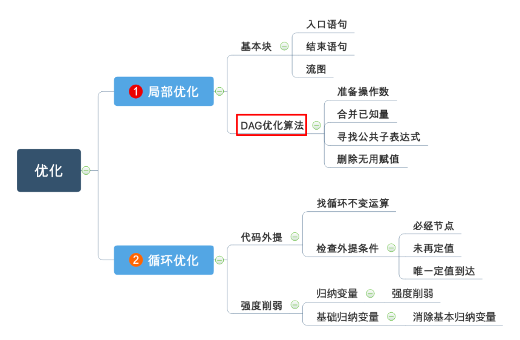
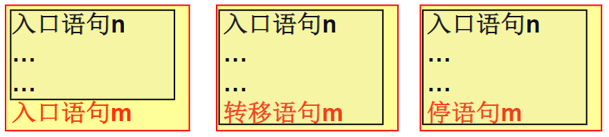
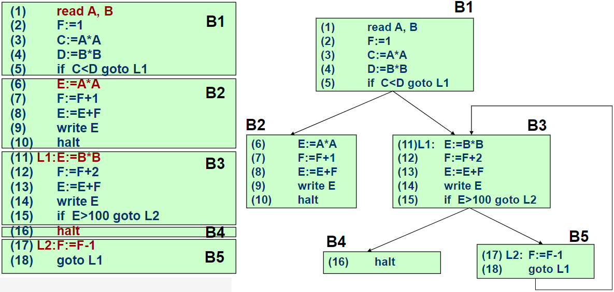

## 提纲

## 概述

优化：对程序进行各种等价变换，使得从变换后的程序出发，能生成更有效的目标代码。

原则
- 等价
- 有效
- 合算

级别
- 局部优化
- 循环优化
- 全局优化

种类
- 删除公用子表达式
- 复写传播
- 删除无用赋值
- 代码外提
- 强度削弱
- 变换循环控制条件
- 合并已知量

## 局部优化

### 基本块

基本块
- 指程序中一顺序执行语句序列，其中只有一个入口和一个出口。入口就是其中第一个语句，出口就是其中最后一个语句。

活跃
- 基本块中的一个名字在某个给定点之后仍被引用, 则称该名字在给定点是活跃的

局部优化
- 局限在基本块范围内的优化

划分基本块
- 基本块入口
  - 程序第一条语句
  - **能**转移到的语句
  - 转移语句后面的语句
- 基本块的出口(包括)
  - 基本块入口的前一条语句
  - 转移语句(包括)
  - 停语句(包括)
- 不在基本块中的语句可以从程序中删除
  

基本块中的优化
- 删除公用子表达式
- 删除无用赋值
- 合并已知量: `T1=2; T2=4*T1;` => `T2=8;`
- 临时变量改名
- 交换语句的位置
- 代数变换: 删除`x=x+0; x=x*1;`, `x=y^2;` => `x=y*y;`

### 流图

- 把基本块编号后按执行顺序连接成一张图
- 入口语句是流图的首结点

前驱和后继
- 在程序序列中, 若A,B相邻而且A最后一条语句不是无条件跳转, 则称A是B的前驱, B为A的后继

### 基本块的DAG表示

- 用带有标记或附加信息的DAG来表示变量间的关系
- 叶结点: 以**标识符或常数**作为标记
- 内部结点: 以**运算符**作为标记
- 每个结点可以有**附加标识符**: 表示附加标识符具有相同的值

### 基本块的DAG优化算法

基本块代码分类
- 0型: 单纯赋值语句`A:=B`
- 1型: 一元运算赋值`A:=op B`
- 2型: 二元运算赋值`A:=B op C`/数组取值赋值`A:=B[C]`

对基本块中每一四元式，依次执行以下步骤:
1. 如果是0型, 记`NODE(B)`的值为`n`, 转4
2. 如果存在任意一个操作数无定义, 则构造该操作数结点
3. 如果所有操作数都是常数
   1. 如果`NODE(B)`(或`NODE(C)`)是新构造的结点, 删除
   2. 计算`op`, 记为`P`
   3. 如果`NODE(P)`无定义, 构造之, 记为`n`
4. 否则
   1. 检查DAG中是否已经存在结点`op`, 如果没有则构造之, 记为`n`
5. 删除无用赋值
    1. 如果`A`已经在某个结点处定义, 删除之, 把`A`附在`n`结点上, 令`NODE(A)=n`

DAG优化算法
- 执行上述算法
- 在基本块外被定值的标识符作为叶子结点上的标识符
- 在基本块内被定值且在基本块后被引用的标识符作为结点上的附加标识符

## 循环优化

不考, 略
