# 按章节

## 1.9 OSI七层模型

设计者: 国际标准化组织ISO, 国际电信联盟ITU

OSI七层模型: 物理层/数据链路层/网络层/传输层/会话层/表示层/应用层

TCP/IP位于: 传输层/网络层

会话层和表示层几乎没有内容

## 3.4 CS模型

| 服务端程序S                         | 客户端程序A          |
| ----------------------------------- | -------------------- |
| 先启动                              | 后启动               |
| 不知道C                             | 必须知道S的位置      |
| 积极等待C来连接                     | 需要通讯时初始化连接 |
| 通过收发数据进行通讯                | 通过收发数据进行通讯 |
| 服务之后继续运行, 等待下一个C来连接 | 可能结束             |

Internet只提供基本通讯, 实际上是由计算机上的程序来处理连接

## 3.5 C/S程序的特点

略

## 3.13 网络编程Socket API

事实标准: Socket API

## 4.6 URL和超链接
## 4.7 HTTP
## 4.17 DNS和域名
## 4.20 名字解析
## 5.5 与数据传输相关的话题

* 信息源
* 数据源编码/解码器
* 加密/解密器
* 通道编码/解码器
* 复用/解复用器
* 调制/解调器
* 物理信道和传输

## 7.18 低地卫星(LEO)和集群

LEO卫星群协同工作以转发消息。集群成员必须知道当前在地球给定区域上的卫星，并将消息转发给适当的成员以传输到地面站。

## 8.6 奇偶校验码

单奇偶校验（SPC）是信道编码的一种基本形式，其中发送方**在每个字节上添加一个额外的位，以使1的个数为偶数（或奇数）**，接收方验证输入的数据是否具有正确的1位数。

## 8.12 因特网使用的16位校验和

源数据M, 任意长度

1. 补零, 直至长度是16位的倍数
2. 将M按照16位分组并求和, 最多允许溢出到32位
3. 将结果对半相加(高16位加低16位), 只保留16位
4. 将结果取反
5. 如果是0则再取反

取反的目的: 方便验证, 只要求完相加判断是否溢出剩0就行了

## 8.13 CRC

例: data=`10010101010`, G=`10101`
多项式表示: $G=x^5+x^3+1$

1. 补零

  `mdata = data + '0' * (G.length - 1)`

  得到`mdata = 100101010100000`

2. 模2除法

  ```js
          ___101100101100_
    10101/100101010100000
        / 10101 |   | | |
         =  11110   | | |
            10101   | | |
           = 10111  | | |
             10101  | | |
            =   10010 | |
                10101 | |
               =  11100 |
                  10101 |
                 = 10010|
                   10101|
                  =  1110
  ```

  得到CRC=`1110`

3. 拼接

  发送的数据`send = data + CRC`
  
  `send = 1000101010 1110`

## 9.12 单工/半双工/全双工传输

信道的三种类型

单工: 只能单向传输, 单根光纤就是单工, 类比收音机, 电视

全双工: 可以同时双向传输, 有两个光纤就可以组成全双工, 类比电话

半双工: 需要一个共享传输介质, 可以双向传输但是不能同时, 类比对讲机

## 10.3 模拟调制

载波: 信息发送出去时以电波的形式, 负责承载信息的波就是载波

调制: 根据要发送的信息, 对载波进行的调整

    原始载波(输入1) --\
                    (调制器) ---> 调制过的载波(输出)
    信息 (输入2)    --/

三种主要调制技术: 
* 振幅调制
* 频率调制
* 移相调制

## 10.12 Modem

为了方便网络安装, 一般将调制和解调功能集成在一个叫做调制解调器的设备中

## 12.6 局部环路特性和适应

接入技术: ISP到用户的连接

本地用户环路(local subscriber line)/本地环路(local loop): 电话公司交换局到用户之间的物理连接, 一般是使用双绞线 (其实就是电话线路?)

DSL: 一种利用local loop提供网络的技术

ADSL: 不对称DSL, 利用频分复用将local loop的带宽分成三个区域

| 频率     | 功能             |
| -------- | ---------------- |
| 0-4      | 普通老式电话业务 |
| 26-138   | 上行频带         |
| 138-1100 | 下行频带         |

因为本地环路的电气特性变化各异，ADSL采用了自适应技术，即一对调制解调器先探测彼此之间连接线路上的许多频率，然后选择在此线路上能产生最优传输质量的频率和相应的调制技术。

## 12.7 ADSL的传输速率

上行: 32 - 640 Kbps, 去掉控制信道: 32 - 576 Kbps

下行: 32 - 8448 Kbps

## 12.9 电缆调制解调器技术

本地环路具有局限性: 双绞线不抗干扰, 

因此创造了基于 同轴电缆 + FDM + 统计复用 的电缆调制解调器技术, 每一组用户共享一个数据信道, 通过Modem判断数据是否属于该用户

传输速率: 上行 512 Kbps, 下行 52 Mbps

## 13.4 本地和广域包交换网络

| 类型 | 距离      |
| ---- | --------- |
| LAN  | 房间/建筑 |
| MAN  | 大城市    |
| WAN  | 多个城市  |

## 13.9 包识别, 解复用, MAC地址

地址: 在包交换系统中, 解复用时使用的标识符, 每个包都包含了目的地地址

IEEE地址(MAC地址): 48位地址, 每个NIC都不一样, 分为前24位OUI, 24位NIC地址

## 13.10 单播, 广播, 多播

IEEE保留了MAC地址中的一位(最高有效字节的最低位)来区分单播(0)和多播(1)

广播视为一种特殊的多播, 广播地址所有位全1

| 类型 | 解释                                                                               |
| ---- | ---------------------------------------------------------------------------------- |
| 单播 | 唯一标识一台计算机，并规定只有被标识的那台计算机才能接收分组的副本                 |
| 广播 | 对应所有的计算机，并规定网络上每台计算机都应该接收分组的副本                       |
| 组播 | 标识指定网络上所有计算机的一个子集，并规定该子集中的每台计算机都应该接收分组的副本 |

## 13.11 广播, 多播和多点传递

在LAN中, 广播和多播极大地提高了效率

## 14.6 随机接入协议

接入技术: 多台相互独立的计算机如何进行协调接入一个**共享介质**

MAC层: Media **Access** Control 介质接入控制

方法: 采用复用技术的改进形式, 采用分布式算法

多址接入协议
- 受控接入协议
  - 预约
  - 轮询
  - 令牌传递
- 随机接入协议
  - ALOHA
  - CSMA/CD
  - CSMA/CA
- 信道分配协议
  - FDMA
  - TDMA
  - CDMA

在LAN中, 用户接入共享介质的时机是随机的, 因此可能造成冲突, 需要用合适的方法解决

| 类型    | 描述                                                                                                                    |
| ------- | ----------------------------------------------------------------------------------------------------------------------- |
| ALOHA   | 教科书中流行的协议, 但没有实际应用, 划分上行/下行两个频段用来传输信息, 上行采用随机延迟来解决冲突问题, 下行采用广播机制 |
| CSMA/CD | 带冲突检测的载波侦听多址接入, 原始以太网使用, 但交换式以太网不再使用, 使用载波侦听+冲突检测+指数退避算法解决冲突问题    |
| CSMA/CA | 带冲突避免的载波侦听多址接入, 无线LAN使用, 与CSMA/CD类似, 不同在于分组传输前会发送一个控制报文, 接收方广播控制消息      |

CSMA/CD: 
- Carrier Sense载波侦听
- Multiple Access多址接入
- Collision Detect冲突检测

CSMA/CA: 
- Carrier Sense载波侦听
- Multiple Access多址接入
- Collision Avoidance冲突避免

## 15.3 以太网帧格式

(传统)以太网: 是一种LAN技术, 最早在施乐公司的PARC中发明, 后来被标准化

帧: 数据链路层的协议数据单元

(传统)以太网帧格式:

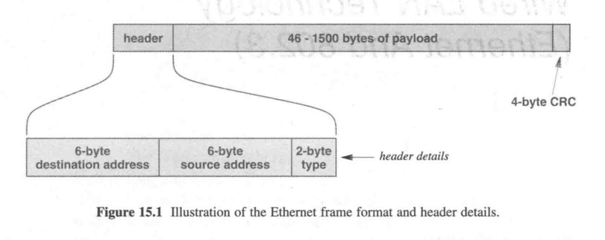

* 以太网帧(64-1518) := 头部(14) + 载荷(46-1500) + CRC(4)

* 头部 := 目的地址(MAC地址, 6) + 源地址(MAC地址, 6) + 类型(2)

## 15.4 以太网帧的类型域

以太网帧类型域包含了载荷中的报文类型, 如IPv4/IPv6/ARP等, 接收方检查该值来进行复用与解复用

## 15.5 802.3以太网

802.3以太网: IEEE 802.3重新修订后的以太网标准, (但不是很成功)

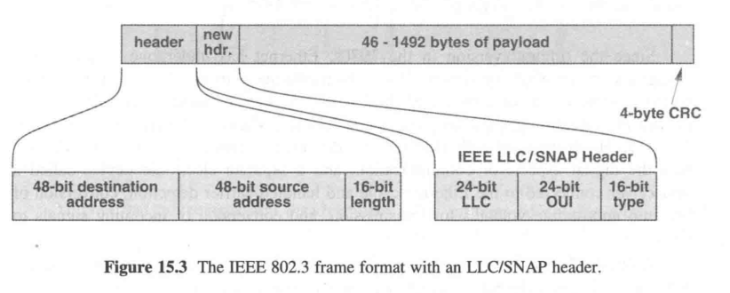

* 802.3以太网帧(64-1518) := 头部(14) + **SNAP头部(8)** + 新载荷(46(存疑)-**1492**) + CRC(4)

* 头部 := 目的地址(MAC地址, 6) + 源地址(MAC地址, 6) + **帧长度(2)**

* **SNAP头部 := LLC(3) + OUI(3) + 类型(2)**

* 兼容性处理: 类型域<=1500是802.3帧, 否则是传统以太网帧 

## 15.7 粗缆布线的以太网

粗缆以太网(Thick wire Ethernet)/粗网(Thicknet, 10Base5): 最初版本的以太网布线方案, 因为其使用笨重的同轴电缆+收发器+AUI电缆方式而得名.

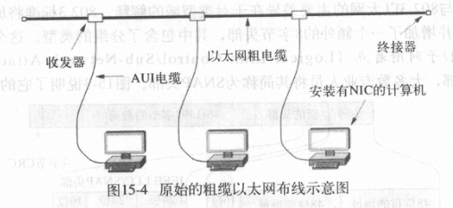

## 15.8 细缆布线的以太网

细缆以太网(Thin wire Ethernet)/细网(Thinnet, 10Base2): 第二代以太网布线方案, 使用细同轴电缆依次串联计算机, 不再需要AUI线, 收发器集成到NIC中, 缺点是容易单点故障 

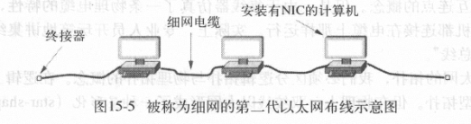

## 15.9 双绞线布线的以太网

双绞线以太网(10BaseT): 第三代以太网布线系统, 使用了双绞线取代同轴电缆, 引入中心集线器(hub)

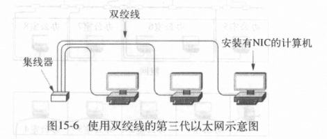

集线器是物理层设备, 具有一定的功能, 比如CSMA/CD等, 现在大部分已经被交换机取代

## 16.2 无线网络的分类

和有线网络类似: 个域网/局域网/城域网/广域网

## 16.3 个域网

蓝牙/红外/ISM无线

## 16.5 WLAN和Wi-Fi

WLAN技术的种类很多, 归类于IEEE802.11标准

Wi-Fi联盟: 一群无线设备供应商组成的非营利性组织, 使用802.11标准对无线设备进行测试与认证

## 16.8 WLAN基础结构

WLAN的三个构件: 接入点(Access Point, AP, 非正式也称基站), 互联机构(交换机或路由器等), 无线主机(Station)

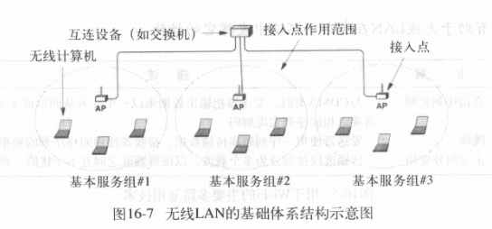

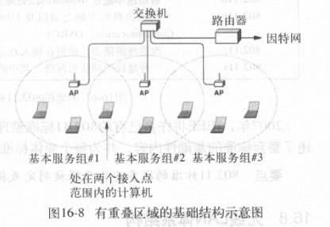

WLAN的两种类型: Adhoc无接入点结构(很少), Infrastructure有中心接入点

互联设备到AP的有线连接通常使用双绞线以太网

基本服务组(BSS): 在某一个给定AP范围内的计算机集合

## 16.9 重叠, 关联, 802.11帧格式

重叠: 两个AP太近, 一台STA可以同时触及到两个AP

802.11要求每个主机只能与一个AP相关联(associate), 而且在802.11帧中携带了AP的MAC地址

* 接入点MAC
* 本机地址
* 路由器MAC
* 专用地址

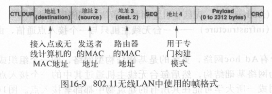

## 16.11 竞争与无竞争接入

802.11定义了两种接入方法
- 点协调功能PCF
- 分布式协调功能DCF

隐蔽站问题: WLAN中所用的发射机有一个受限的发射范围, 离发射机的距离超过发射范围的接收方将无法收到信号, 因而无法检测载波

802.11使用CSMA/CA协议来解决接入中的隐蔽站问题
* 传输分组前交换一对RTS,CTS控制报文
* 没有冲突检测, 而是采用确认ACK+超时重传机制
* 设定SIFS(发ACK前延时)/DIFS(传输前延时)/Slot Time等时间间隔参数

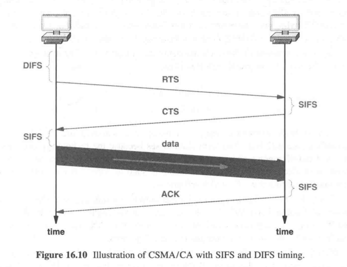

## 16.13 PAN技术与标准

- 802.15.1a  蓝牙
- 802.15.3a  UWB 超宽带
- 802.15.4   Zigbee 工业无线控制标准 

## 17.3 光纤猫扩展

最简单的LAN扩展机制: 光纤+一对光纤猫, 连接一台计算机和一个远程以太网

## 17.4 中继器

中继器: 信号放大, 信号转发, 早期广泛应用

## 17.5 网桥与桥接

网桥: 往往用来连接两个LAN网段(比如hub), 保证两边的计算机都能互相连通

计算机无法分辨LAN中有无网桥

## 17.6 自学习网桥与帧过滤

网桥与一根网线直连的区别: 网桥分隔冲突域, 但不分隔广播域 **网桥仅在有必要的时候才进行转发**
* 源地址和目标地址位于两个网段
* 广播帧和多播帧

网桥能够自动学习设备位于网桥的哪一侧(基于分组中的源MAC地址)

## 17.7 桥接的好处

桥接的各个网段可以同时进行传输, 使得不同建筑物之间的通讯成为了可能

## 17.8 分布式生成树

如果网桥连接导致网络中存在环路, 那么广播和多播帧会被无限循环转发下去

因此网桥会执行生成树算法来生成一个树

## 18.7 下一条转发

分组交换机收到一个分组后, 如果分组的目的地不是直连在交换机上, 就需要查表转发

交换机的转发表: 目的地址:输出接口

## 18.9 广域网动态路由更新

转发表的要求
* 全局通信 - 必须覆盖所有可能目的地的
* 最优路径 - 下一条必须是距目的地的最短路径

路由软件: 自动重新配置转发表的软件

## 18.12 分布式路径计算

分布式路径计算的两种常用形式:
* 链路状态路由LSR, 采用Dijkstra算法
* 距离向量路由DVR

LSR: 每台交换机定期广播一条边的状态, 相邻交换机据此更新自己的转发表

DVR: 每台交换机定期告诉相邻交换机自己的距离向量表(包含一对(目的,距离)), 相邻交换机据此更新自己的转发表

## 18.13 最短路径的计算

Dijkstra算法

## 20.6 用路由器连接物理网络

路由器是一台专门完成网络互联任务的专用硬件系统, 可以将多个使用不同技术（包括不同的传输介质、物理编址方案或帧格式）的网络互相连接（互联）起来 (比如连接以太网和WiFi网)

## 21.7 IP有类编址方案

IP地址**有类编址方案**
| 类别    | 标识位 | 前缀长度 | 最大网络数量 | 后缀长度 | 最大主机数量 |
| ------- | ------ | -------- | ------------ | -------- | ------------ |
| A       | 0      | 7        | 128          | 24       | 2^24         |
| B       | 10     | 14       | 16384        | 16       | 65536        |
| C       | 110    | 21       | 2^21         | 8        | 256          |
| D(组播) | 1110   | -        | -            | -        | -            |
| E(保留) | 1111   | -        | -            | -        | -            |

## 21.10 IP无类编址方案

IP地址**无类/子网编址方案**: 引入附加的地址掩码(子网掩码)来指定网络地址和主机地址的分界线

无类地址 & 子网掩码 == 网络地址

## 21.21 IPv6地址

和IPv4类似, IPv6为每个接入网络的计算机分配了一个独一无二的地址

IPv6的特点

* 将`网络地址`进一步细分为`全球单播地址`和`子网地址`两部分, `主机地址`仍保留, 两者共128位, 用`/xx`来表示`网络地址`的长度, 如不指定默认是64位

  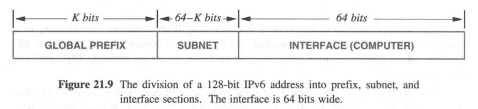

* 取消`广播`, 支持`多播`, 增加`任播`(anycast)

  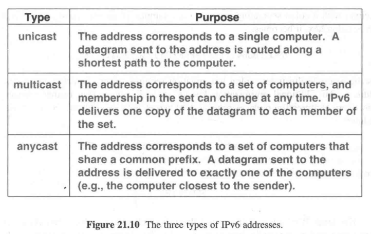

## 22.4 IP数据报

IP数据报 := 头部 + 数据区(载荷区)

## 22.5 IP数据报头部格式

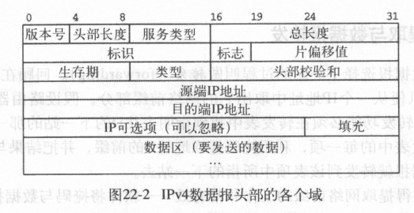

## 22.7 网络前缀提取与数据报转发

根据网络地址查询转发表发给下一站

## 22.8 最长前缀匹配

查询转发表时如果有多项匹配, 采用**最长前缀匹配**规则

## 22.11 IP封装

IP数据报要被封装到一个帧里才能发送出去, 帧的目的地址是下一站的IP地址对应的MAC地址(通过ARP协议获得)

## 22.14 IP分片和重装机制
## 22.15 分片数据报的收集

最大传输单元MTU: 每种物理网络规定的一帧能够携带的最大数据量

IP数据报分片机制: 当一个数据报长度大于前方网络的MTU时, 路由器会将数据报分成若干较小的片(fragment), 然后将每一片独立地封装发送出去

分片: 每个片与数据报的格式一样, 头部部分参数不同
* 标识: 每个数据报的唯一标识, 同一个原始数据报的所有片段的标识是一样的
* 标志: 标识了该数据报是片还是完整的数据报, 以及是否是最后一片
* 片偏移: 该片在原数据报中的位置

重装: 在所有片的基础上重新产生原数据报的过程, **IP规定只有最终目的主机才能对片进行重装**

## 23.9 ICMP报文格式与封装

因特网控制报文协议(ICMP): 利用IP来传输IP传输中发生的错误

ICMP报文放置在IP数据报的数据区传输

## 23.10 协议软件, 参数和配置

协议软件采用参数化设计

主机配置采用自举过程, 运行时获取到IP地址, 掩码, DNS服务器地址等参数填入程序中运行

## 24.3 UDP

UDP的特征: 
* 端到端: UDP是一个传输协议, 它能区分运行在给定计算机上的多个应用程序
* 无连接: UDP提供给应用的接口遵从无连接模式
* 面向报文: 使用UDP的应用进程所发送和接收的数据是单个报文
* 尽力而为: UDP提供给应用的是与IP一样的尽力传递机制
* 任意交互: UDP允许应用进程给很多其他应用进程发送数据, 也允许从很多其他应用进程那里接收数据, 或者只跟一个其他应用进程相互通信
* 操作系统无关: UDP所提供的标识应用程序的方法, 不取决于本地操作系统所使用的标识符

## 24.4 无连接的通信模式

UDP采用无连接通信模式, 可以在任何时候发送数据, 不需要维护通信状态, 也不使用控制报文, 因此传输开销极低

## 24.7 交互模式和广播传递

UDP支持四种交互通信方式:
* 一对一
* 一对多
* 多对一
* 多对多

底层是利用IP组播和广播机制实现的

## 24.8 用协议端口号标识端点

协议端口号: 用来标识应用程序的**标识符抽象集**, 独立于底层操作系统

## 25.3 TCP

TCP提供的服务有7个主要特点:
* 面向连接: TCP提供面向连接的服务, 应用程序必须首先请求建立一个到目的地的连接, 然后使用这个连接来传输数据 
* 点对点通信: 每个TCP连接上只有两个端点 
* 完全的可靠性: TCP能保证在一个连接上发送的数据被正确地传递, 且保证数据的完整和按序到达 
* 全双工通信: TCP连接允许数据在任何一个方向上流动, 并允许任何应用程序在任何时刻发送数据 
* 流接口: TCP提供一个流接口, 利用它应用进程可以在一个连接上发送连续的字节流. TCP不必将数据组合成记录或是报文, 也不要求传递给接收应用进程的数据段大小一定要与发送端所送出的数据段大小相同 
* 可靠的连接建立: TCP允许两个应用进程可靠地开始通信 
* 友好的连接关闭: 在关闭一个连接之前, TCP必须保证所有数据已经传递完毕, 并且通信双方都要同意关闭这个连接 

## 25.4 端对端服务与虚拟连接

TCP和UDP都是**端到端协议**: 提供在一台计算机上的应用进程与另一台计算机上的应用进程之间的通信能力

TCP是**面向连接**的协议, TCP提供的连接是一种虚拟连接, 因为它是软件实现的连接

TCP将底层因特网视为一个通信系统

## 25.5 一般可靠传输协议所采用的技术

- 分组乱序
  - 排序技术: 每个分组都附加一个序号

- 分组丢失
  - 带重传的正向确认: 接收方发送ACK报文表示成功接收; 若超时仍未收到ACK, 则重传

- 分组重复(重放错误)
  - 每一次会话用一个唯一的ID标识

- 数据过载
  - 停-走系统: 不好, 效率很低
  - 滑动窗口: 定义**窗口大小**为接收方一次可以承载的最大数据量/发送方收到ACK前可以发送的最大数据量, 发送方收到ACK之后窗口向后移动

## 25.11 缓冲, 流控制, 窗口

TCP使用了以字节计量的窗口, 接收方将自己剩余的缓冲区大小放在ACK报文中, 发送方根据这个窗口大小来决定是继续发送还是停止

## 26.4 动态路由和路由器

每个路由器都运行路由软件，该软件了解其他路由器可以到达的目的地，并向其他路由器通知其可以到达的目的地。路由软件使用传入的信息来连续更新本地转发表。

## 26.7 两类因特网路由协议

因特网路由协议的分类:
* 内部网关协议IGP: 自治系统内部使用的协议, 可以自由选择, 例如RIP, OSPF, is-is等
* 外部网关协议EGP: 自治系统之间使用的协议, 例如BGP

路由度量指标: 评价路由路径好坏的指标

* 尽管大多数Internet路由协议都设计为使用跃点作为路由指标，网络管理员也可以覆盖该指标以实施策略。

* 在自治系统中，IGP软件使用路由度量来选择到达每个目的地的最佳路径。 EGP软件可以找到到达每个目的地的路径，但是找不到最佳路径，因为它无法比较来自多个自治系统的路由度量。

## 26.12 OSPF协议

RIP是内部网关协议, 使用**距离矢量算法**来传递路由信息。RIP 是在 UDP 协议之上的一种路由协议，应用于 OSI 网络七层模型的**网络层**。

OSPF是内部网关协议，它使用**链路状态算法**来传播路由信息。路由器使用**Dijkstra算法**计算最短路径。

## 26.16 组播路由技术

IP组播群组的成员关系构成是动态的，即计算机可以随时加入或离开一个群组。群组成员关系只是定义了一组接收者；任意一个应用进程（即使它不是一个群组成员）都能发送数据报给组播群组。

因特网组播的动态特性使它的组播路径传播问题变得很困难。虽然已经提出了很多协议，但是目前因特网还没有全网范围内的组播路由设施。

## 29.9 私有密钥(对称)加密
## 29.10 公开密钥(非对称)加密
## 29.11 使用数字签名的鉴别

签名: 发送方使用自己的私钥对报文进行加密

验证: 接收方使用发送方的公钥进行解密

认证+加密: 发送者先对报文进行签名, 再用接收者的公钥进行加密

## 29.13 防火墙

防火墙: 防止因特网上的问题扩散到本地内部的计算机上的技术, 一般放置在本单位的网络与外部因特网之间

## 29.14 包过滤防火墙的实现

防火墙利用包过滤技术来防止不希望有的通信交互。每种过滤器规则都要给出数据包头部参数的组合，包括IP源地址、目的地址、协议端口号和传输协议类型等。

## 30.7 SNMP

简单网络管理协议SNMP: 基于IP的网络管理的标准协议

# 按作业内容

## TCP/IP的分层模型

物理层/网络接口层/网络层/传输层/应用层

## 导线类型

* 无屏蔽双绞线(UTP)
* 屏蔽双绞线(STP)
* 同轴电缆(CC)

## 通信卫星类型

| 类型              | 优点               | 缺点         |
| ----------------- | ------------------ | ------------ |
| 低地球轨道(LEO)   | 低时延             | 相对地球移动 |
| 中地球轨道(MEO)   | 主要提供南北级通信 | -            |
| 地球静止轨道(GEO) | 相对地球静止       | 距离远       |

## 为什么要区分上下行通信

大多数因特网用户都是按非对称（asymmetric）模式使用网络的，即典型的居民用户从因特网接收的数据要多于他们发送出去的数据。例如，为了浏览一个网页，浏览器发送一个只包含几个字节的 URL，而 Web 服务器响应回来的内容可能是包含几千字节的文本或者是一个包含好几万字节的图片。运行 Web 服务器的商业用户可能具有相反的流量模式——商业用户发送的数据要多于接收的数据。

## 宽带与窄带

窄带接入技术:
- 拨号电话连接
- 使用调制解调器的租用电路
- 部分 T1 数据电路
- ISDN 及其他电信数据服务

宽带接入技术:
- DSL 技术
- 电缆调制解调器技术
- 无线接入技术
- T1 速率或更高速率的数据线路

## 

# 背背背

## TCP的特征

* 面向连接: TCP提供面向连接的服务, 应用程序必须首先请求建立一个到目的地的连接, 然后使用这个连接来传输数据 
* 点对点通信: 每个TCP连接上只有两个端点 
* 完全的可靠性: TCP能保证在一个连接上发送的数据被正确地传递, 且保证数据的完整和按序到达 
* 全双工通信: TCP连接允许数据在任何一个方向上流动, 并允许任何应用程序在任何时刻发送数据 
* 流接口: TCP提供一个流接口, 利用它应用进程可以在一个连接上发送连续的字节流. TCP不必将数据组合成记录或是报文, 也不要求传递给接收应用进程的数据段大小一定要与发送端所送出的数据段大小相同 
* 可靠的连接建立: TCP允许两个应用进程可靠地开始通信 
* 友好的连接关闭: 在关闭一个连接之前, TCP必须保证所有数据已经传递完毕, 并且通信双方都要同意关闭这个连接 

## UDP的特征

* 端到端: UDP 是一个传输协议，它能区分运行在给定计算机上的多个应用程序。
* 无连接: UDP 提供给应用的接口遵从无连接模式。
* 面向报文: 使用 UDP 的应用进程所发送和接收的数据是单个报文。
* 尽力而为: UDP 提供给应用的是与 IP 一样的尽力传递机制。
* 任意交互: UDP 允许应用进程给很多其他应用进程发送数据，也允许从很多其他应用进程那里接收数据，或者只跟一个其他应用进程相互通信。

## 服务端-客户端特征

虽然存在少量的变种，但大多数客户——服务器交互模式都具有相同的一般特征。一般情况
下，客户软件具有如下特征：
1. 它是一个任意的应用程序，仅在需要进行远程访问时才暂时成为客户，同时还要完成其他的计算任务。
2. 直接受用户介入操作，并且只执行一个会话过程。
3. 在用户的个人计算机上进行本地运行。
4. 主动地发起与服务器的连接请求。
5. 能访问所需的多种服务，但通常一次只与一个远地服务器请求连接。
6. 不会特别地要求功能强大的计算机硬件。

而服务器软件的特征如下：
1. 它是一个专门提供某种服务的专用特权程序，但同时可以处理多个远程客户的请求。
2. 在系统启动时自动被调入执行，进行多次会话并持续不断地运行。
3. 运行在大型、高性能计算机上。
4. 被动地等待来自任意的远端客户的通信请求。
5. 接收来自任何客户的通信请求，但只提供单一的服务。
6. 要求功能强大的硬件和高级复杂的操作系统支持。

## 

## 端口号

FTP: 20/数据流, 21/控制流
TELNET: 23
SMTP: 25
DNS: 53
SNMP: 161/162