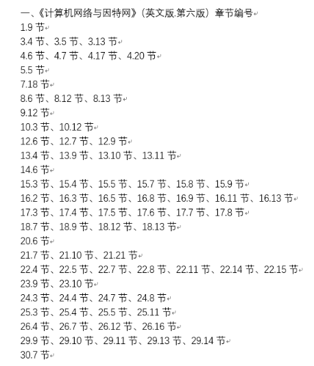

# 计算机网络复习

## 按章节

### 1.9 OSI七层模型

设计者: 国际标准化组织ISO, 国际电信联盟ITU

OSI七层模型: 物理层/数据链路层/网络层/传输层/会话层/表示层/应用层

TCP/IP位于: 传输层/网络层

会话层和表示层几乎没有内容

### 3.4 CS模型

| 服务端程序S                         | 客户端程序A          |
| ----------------------------------- | -------------------- |
| 先启动                              | 后启动               |
| 不知道C                             | 必须知道S的位置      |
| 积极等待C来连接                     | 需要通讯时初始化连接 |
| 通过收发数据进行通讯                | 通过收发数据进行通讯 |
| 服务之后继续运行, 等待下一个C来连接 | 可能结束             |

Internet只提供基本通讯, 实际上是由计算机上的程序来处理连接

### 3.5 C/S程序的特点

略

### 3.13 网络编程Socket API

事实标准: Socket API

### 9.12 单工/半双工/全双工传输

信道的三种类型

单工: 只能单向传输, 单根光纤就是单工, 类比收音机, 电视

全双工: 可以同时双向传输, 有两个光纤就可以组成全双工, 类比电话

半双工: 需要一个共享传输介质, 可以双向传输但是不能同时, 类比对讲机

### 10.3 模拟调制

载波: 信息发送出去时以电波的形式, 负责承载信息的波就是载波

调制: 根据要发送的信息, 对载波进行的调整

    原始载波(输入1) --\
                    (调制器) ---> 调制过的载波(输出)
    信息 (输入2)    --/

三种主要调制技术: 调幅, 调频, 移相调制

### 10.12 Modem

为了方便网络安装, 一般将调制和解调功能集成在一个叫做调制解调器的设备中

### 12.6 局部环路特性和适应

接入技术: ISP到用户的连接

本地用户环路(local subscriber line)/本地环路(local loop): 电话公司交换局到用户之间的物理连接, 一般是使用双绞线 (其实就是电话线路?)

DSL: 一种利用local loop提供网络的技术

ADSL: 不对称DSL, 利用频分复用将local loop的带宽分成三个区域

| 频率     | 功能             |
| -------- | ---------------- |
| 0-4      | 普通老式电话业务 |
| 26-138   | 上行频带         |
| 138-1100 | 下行频带         |

因为本地环路的电气特性变化各异，ADSL采用了自适应技术，即一对调制解调器先探测彼此之间连接线路上的许多频率，然后选择在此线路上能产生最优传输质量的频率和相应的调制技术。

### 12.7 ADSL的传输速率

上行: 32 - 640 Kbps, 去掉控制信道: 32 - 576 Kbps

下行: 32 - 8448 Kbps

### 12.9 电缆调制解调器技术

本地环路具有局限性: 双绞线不抗干扰, 

因此创造了基于 同轴电缆 + FDM + 统计复用 的电缆调制解调器技术, 每一组用户共享一个数据信道, 通过Modem判断数据是否属于该用户

传输速率: 上行 512 Kbps, 下行 52 Mbps

### 13.4 本地和广域包交换网络

| 类型 | 距离      |
| ---- | --------- |
| LAN  | 房间/建筑 |
| MAN  | 大城市    |
| WAN  | 多个城市  |

### 13.9 包识别, 解复用, MAC地址

