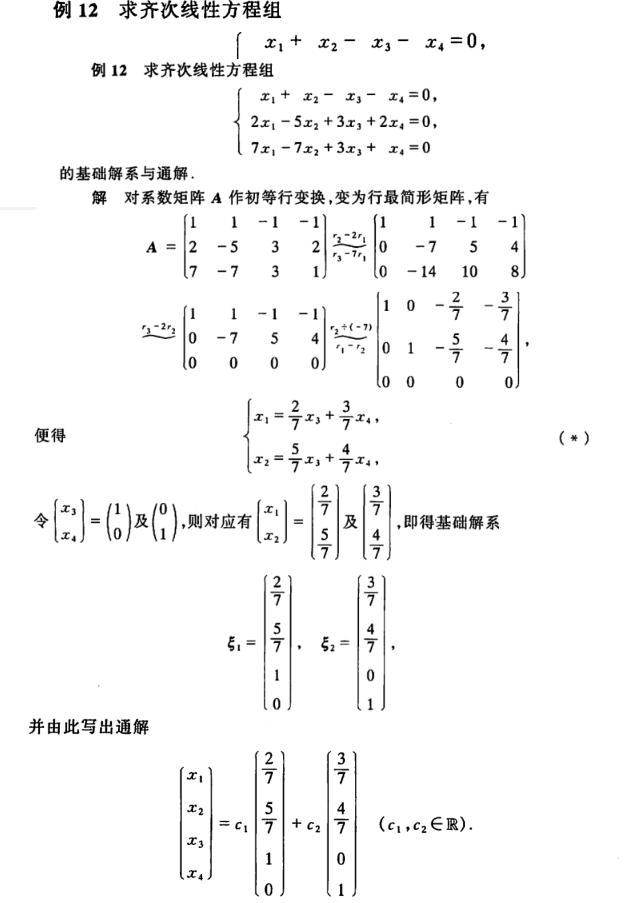
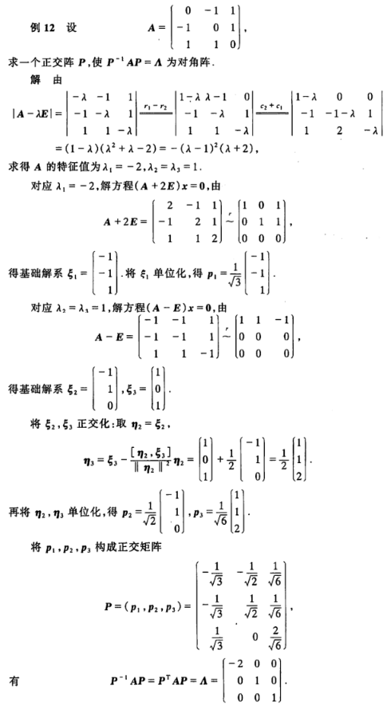

# 线性代数笔记

## 1. 行列式

### 基本概念

二阶行列式

三阶行列式

全排列

对换

n阶行列式

上下三角行列式

对角行列式

转置行列式

#### 性质

* 转置行列式, 行列式不变
* 对换行(列), 行列式变号
  * 两行(列)完全相同, 行列式=0
  * 两行(列)成比例, 行列式=0
* 一行(列)乘k = 整体乘k
  * 行(列)系数提到外面, 行列式不变
* 可以按照某一行(列)分成两个行列式相加
* 一行乘k加到另一行, 行列式不变

### 按行(列)展开

* 余子式 $M_{ij}$
* 代数余子式 $A_{ij}=(-1)^{i+j}{M_{ij}}$

#### 性质

* 按行(列)展开法则 $D=\sum_{i=1}^{n}{a_{ij}A_{ij}}, (j=1,2,...,n)=\sum_{j=1}^{n}{a_{ij}A_{ij}}, (i=1,2,...,n)$

* 如果上式中$a$和$A$的$j(i)$错开, 则结果为0

#### 范德蒙德行列式

$$
D_n=\begin{vmatrix}
1&1&...&1 \\
x_1&x_2&...&x_n \\
x_1^2&x_2^2&...&x_n^2 \\
:&:& &: \\
x_1^{n-1}&x_2^{n-1}&...&x_n^{n-1}
\end{vmatrix} 
=\prod_{n\ge i\ge j\ge 1}{(x_i-x_j)}
(注意顺序)
$$

## 2. 矩阵及其运算

线性方程组

非齐次线性方程组

齐次线性方程组

齐次线性方程组的零解

### 矩阵

同型矩阵

系数矩阵

未知数矩阵

常数项矩阵

增广矩阵

线性变换

#### 按性质

* 非奇异矩阵/可逆矩阵/满秩矩阵
* 奇异矩阵/不可逆矩阵/降秩矩阵

#### 按形状

* 对角矩阵
* 单位矩阵
* 对称矩阵

### 矩阵运算

* 矩阵加法
  * 负矩阵
* 数乘
* 矩阵乘法
  * 可交换
  * 纯量阵: 一定可交换
* 幂
* 转置
* 行列式
* 伴随矩阵
* 矩阵多项式

#### 性质

##### 转置性质

* 自反性 $(A^{T})^{T}=A$
* 线性 $(\lambda A+B)^{T}=\lambda A^{T}+B^{T}$
* 嵌套 $(AB)^{T}=B^{T}A^{T}$
* 判零 $A^TA=O\Leftrightarrow A=O$

##### 行列式性质

* 常数放大 $\left|\lambda A\right|=\lambda^n\left|A\right|$
* 可乘性 $\left|AB\right|=\left|A\right|\left|B\right|$

### 矩阵分块法

分块矩阵

子块

分块对角矩阵
* 性质
  * 行列式 $\left|A\right|=\left|A_1\right|\left|A_2\right|...\left|A_n\right|$
  * 逆

## 3. 初等变换与线性方程组

### 初等变换

行(列)变换 $\Leftrightarrow$ 左(右)乘同样变化之后的$E$
* 对换两行(列)
* 缩放某一行(列)加到另一行(列)上去 (源和目标可以一样)

初等矩阵: 施加一次初等行(列)变换的E

### 矩阵等价

A和B等价: A经若干次初等变化可以变为B

等价关系: 自反性, 对称性, 传递性

推论: $A\sim (r)\sim E\Leftrightarrow{A可逆}$

#### 充要条件

$A\sim (r)\sim B\Leftrightarrow PA=B (P, Q可逆)$

$A\sim (c)\sim B\Leftrightarrow AQ=B (P, Q可逆)$

$A\sim B\Leftrightarrow PAQ=B (P, Q可逆)$

### 行阶梯形矩阵

左下角的0组成了一个从右下到左上的阶梯, 这个阶梯的宽度任意, 但是每一级的高度必定为1(两边不算)

非零首元: 非零行的首个非零元素

$$
\begin{pmatrix}
 x & . & . & . & .\\
 0 & x & . & . & .\\
 0 & 0 & x & . & .\\
 0 & 0 & 0 & x & .
\end{pmatrix}
\begin{pmatrix}
 x & . & . & . & .\\
 0 & 0 & 0 & x & .\\
 0 & 0 & 0 & 0 & 0\\
 0 & 0 & 0 & 0 & 0
\end{pmatrix}
$$

### 行最简形矩阵

在行阶梯型矩阵的基础上, 非零首元都是1, 非零首元的上下都是0, 则为行最简形矩阵

$$
\begin{pmatrix}
 1 & 0 & 0 & 0 & .\\
 0 & 1 & 0 & 0 & .\\
 0 & 0 & 1 & 0 & .\\
 0 & 0 & 0 & 1 & .
\end{pmatrix}
\begin{pmatrix}
 1 & . & . & 0 & .\\
 0 & 0 & 0 & 1 & .\\
 0 & 0 & 0 & 0 & 0\\
 0 & 0 & 0 & 0 & 0
\end{pmatrix}
$$

* 一个矩阵的行最简形矩阵是唯一的

### 标准形

对行最简形矩阵施加初等列变换, 是非零首元依次排列在左边, 右边全0

特点是左上角是个E

$$
\begin{pmatrix}
 1 & 0 & 0 & 0 & 0\\
 0 & 1 & 0 & 0 & 0\\
 0 & 0 & 1 & 0 & 0\\
 0 & 0 & 0 & 1 & 0
\end{pmatrix}
\begin{pmatrix}
 1 & 0 & 0 & 0 & 0\\
 0 & 1 & 0 & 0 & 0\\
 0 & 0 & 0 & 0 & 0\\
 0 & 0 & 0 & 0 & 0
\end{pmatrix}
$$

### 技巧

#### $P(A,B)=(A',B')$

* $P(A, E)=(E, A^{-1})$, 求A逆常用方法
* $P(A, B)=(E, A^{-1}B)$, 解方程常用方法

### 矩阵的秩

子式: 从行中选出一个子序列, 再从列中选出一个子序列, 得到的结果

秩: 最高阶非零子式的阶数

#### 性质

1. 秩一定小于行(列)数
2. 转置不改变秩
3. 等价矩阵的秩一样: $A\sim B\Leftrightarrow{R(A)=R(B)}$
4. 乘可逆矩阵不改变秩
5. 拼接矩阵的秩可能比原秩要大: $max\{R(A),R(B)\}\le{R(A~~B)}$
6. 拼接矩阵的秩不会大于原秩之和: $R(A~~B)\le{R(A)+R(B)}$
7. ---
8. 秩和大于和秩(由上一条可证): $R(A+B)\le{R(A)+R(B)}$
9. 矩阵积的秩不大于任何一个原秩(从变换角度看): $R(AB)\le{min\{R(A),R(B)\}}$
10. $A_{m\times n}B_{n\times l}=O\Rightarrow{R(A)+R(B)\le{n}}$
11. ---
列满秩: 秩等于列数, 对应的行最简形矩阵为$\begin{pmatrix}E_{n} \\ O\end{pmatrix}_{m\times n}$

10. 乘法消去律: $AB=O, A列满秩\Rightarrow B=O$

### 秩与线性方程组的解

相容: 有解

不相容: 无解

判断条件$Ax=b$
* $无解\Leftrightarrow{R(A)\lt{R(A~~b)}}$
* $有解\Leftrightarrow{R(A)={R(A~~b)}}$
  * $有唯一解(齐次就是零解)\Leftrightarrow{R(A)=R(A~~b)=n}$
  * $有无穷解(齐次有非零解)\Leftrightarrow{R(A)=R(A~~b)\lt n}$

## 4. 向量组, 线性相关性

n维向量

实向量

复向量

单位坐标向量: E的列向量

### 向量组

### 线性表示

线性组合

**线性表示**: 一个向量(组)能被另一个向量组线性表示

向量组等价: 两个向量组能互相线性表示

#### 定理

* $向量b能被向量组A线性表示\Leftrightarrow{R(A)=R(A~~b)}$
* $向量组A能被向量组B线性表示\Leftrightarrow R(A)=R(A~~B)$
* $向量组A, B能相互线性表示(等价)\Leftrightarrow{R(A)=R(B)=R(A~~B)}$
* ---
* $若AB=C, 则C的列向量组能被A的列向量组线性表示, 表示的系数为B$
* $同理, C的行向量组能被B的行向量组线性表示, 表示的系数为A$

* $向量组B能被向量组A线性表示\Leftrightarrow R(B)=R(B~~A)\Rightarrow{R(B)\le R(A)}$

### 线性相关

线性相关: 存在一个系数非全零的线性组合=0的向量组

线性无关

#### 性质

* $线性相关\Leftrightarrow{R(A)\lt m}$
* $线性无关\Leftrightarrow{R(A)=m}$
* $线性相关具有保持性质$
* $秩\lt向量个数\Leftrightarrow{线性相关}$
* $向量维数\lt向量个数\Rightarrow{线性相关}$
* $线性无关向量组A+b变线性相关\Rightarrow{b能被A唯一线性表示}$

### 向量组的秩

向量组

最大(线性)无关(向量)组

秩: 最大无关组的向量个数

#### 性质见上节

### 线性方程组解的结构

#### 齐次的解$Ax=O$

* 齐次: 解的线性组合仍是解
* 因此只要找到解集的一个最大无关组即可得出所有解

基本解系: 齐次的解集的一个最大无关组

基本解系的秩: 
* $对于方程组A_{m\times n}x=0, R_S=n-R(A)$

求解步骤:
1. 对A进行行变换变成行最简形矩阵
2. 得到x之间的关系
3. 给每个自由变量赋值一个线性无关的向量(一般取单位向量)

例题:

##### 性质

* $Ax=O和Bx=O同解\Rightarrow R(A)=R(B)$

#### 非齐次的解$Ax=b$

* 非齐次: 利用齐次
* 找到一个特解, 加上齐次的通解即为最终解

### 向量空间

向量空间: 对线性运算封闭的集合

子空间: 含于另一个向量空间的向量空间

基: 在向量空间中, 可以线性表示空间中任一向量的线性无关的向量组

自然基: $R^n$中的单位坐标向量组

维数: 基的向量个数(固定)

坐标: 一个向量在某一个基下的表示

**基变换公式**: 用一个基来表示另一个基的坐标(没啥用)

$$
B=AP=AA^{-1}B
$$

**过渡矩阵**: 旧基逆乘新基, 可以用初等变换的方法快速求

$$
P=A^{-1}B
$$

**坐标变换公式**: 一个向量在两个不同基下的坐标的关系式

$$
新坐标~Z=P^{-1}Y
$$

## 5. 相似矩阵与二次型

内积: 数量积的推广, $[A,B]=A^TB$

长度(范数): 模的推广, $\left|\left|x\right|\right|=\sqrt{[x,x]}$

投影: $c=\frac{[a,b]}{[b,b]}b$

单位向量

单位化

夹角: $\theta=\arccos{\frac{[x,y]}{\left|\left|x\right|\right|~\left|\left|y\right|\right|}}$

### 正交矩阵

正交: 夹角为0

正交向量组: 一组向量两两正交, 必定线性无关

标准正交基: 单位向量组成的正交向量组

标准正交化, 施密特正交化

正交(矩)阵: 单位正交向量组构成的矩阵
* $AA^T=E=A^TA$
* $A^T=A^{-1}$
* $\left|A\right|=1或-1$
* 正交矩阵的逆(转置)也是正交矩阵
* 正交矩阵的积还是正交矩阵

正交变换: $若P是正交矩阵, 则线性变换y=Px称为正交变换$
* 特性
* 变换前后的长度不变 $||y||=\sqrt{y^Ty}=\sqrt{x^TP^TPx}=\sqrt{x^Tx}=||x||$

### 特征值和特征向量

特征多项式: $f(\lambda)=\left|A-\lambda E\right|$

特征值/特征向量: $A为n阶矩阵, 满足Ax=\lambda x, (A-\lambda E)x=0的\lambda和x$

个数: $f(\lambda)=0是一元n次方程, \lambda必有n个根, 所以方程有n个解$

#### 性质

* 特征值之和等于矩阵的迹
* 特征值之积等于矩阵的行列式
* 矩阵多项式的特征值等于矩阵特征值的多项式: $f(\lambda)是f(A)的特征值$
* $特征值各不相等\Rightarrow特征向量线性无关$
* 对角矩阵的对角元就是其特征值

#### 求法

1. 根据特征多项式=0求出特征值
2. 将每个特征值代回原方程, 写出特征向量(个数=n-特征值重数)

### 相似矩阵

相似矩阵: $P^{-1}AP=B$

相似变换: $P^{-1}AP$

#### 性质

* 相似矩阵的特征多项式($f(\lambda)=\left|A-\lambda E\right|$)相同, 特征值相同
* **计算矩阵多项式**: $\varphi(A)=P\varphi(B)P^{-1}$
  * 一般B是对角矩阵, 从而可以快速计算B的幂:

$$
\varphi(\Lambda)=\begin{pmatrix}
\varphi(\lambda_1)&&&\\
&\varphi(\lambda_2)&&\\
&&...&\\
&&&\varphi(\lambda_n)
\end{pmatrix}
$$

#### 对角化

对角化: 寻找相似变换矩阵P来使$P^{-1}AP=\Lambda$为对角矩阵

能对角化的条件: $A有n个线性无关的特征向量$

#### 对称矩阵的对角化

对称矩阵的性质:
* 特征值为实数
* 不相等的特征值对应的特征向量正交
* 一定存在正交矩阵P使得A**可以被对角化**为以特征值为对角元的对角矩阵

求法:
1. 求出A的特征值
2. 求出所有特征向量
3. 把这些特征向量正交化, 单位化
4. 排列得到$P$和$\Lambda$, 注意两者对应

### 二次型, 标准形

二次型: 含n个变量的**二次齐次**函数

$f(x_1,x_2,...,x_n)=\sum{a_{i,j}x_{i}x_{j}}$

标准形(法式): 只含**平方项**的二次型

$f(x_1,x_2,...,x_n)=\sum{k_{i}x_{i}^2}$

规范形: 系数只在-1,0,1中取值的标准形

二次型的矩阵表示: 二次型可以用系数组成的对称矩阵唯一表示

$$
\begin{aligned}
f&=\sum{a_{ij}x_{i}x_{j}}, (a_{ij}=a_{ji})\\
&=\begin{pmatrix}
x_1&x_2&...&x_n
\end{pmatrix}
\begin{pmatrix}
a_{11}&a_{12}&...&a_{1n}\\
a_{21}&a_{22}&...&a_{2n}\\
...&...&...&...\\
a_{n1}&a_{n2}&...&a_{nn}
\end{pmatrix}
\begin{pmatrix}
x_1\\
x_2\\
...\\
x_n
\end{pmatrix}\\
&=x^TAx
\end{aligned}
$$

二次型的秩: 对应矩阵的秩

### 合同对角化

**合同**: $若存在可逆矩阵C使得B=C^TAC, 则称B与A合同$

性质
* 对阵矩阵的合同矩阵也对称

**合同对角化**: $寻找可逆矩阵C, 使得C^TAC为对角矩阵, 从而使二次型A通过x=Cy变换成标准形$

$$
\begin{aligned}
f&=x^TAx\\
&=y^T(C^TAC)y
\end{aligned}
$$

可以证明(由对称矩阵性质)这个矩阵一定存在, 而且是正交矩阵, 变换后的$C^TAC$由特征值构成

### 正定二次型

惯性定理: 同一个二次型的两种标准化结果中正负系数的个数相同

正(负)惯性指数: 其中的正(负)系数的个数

正(负)定二次型, 正(负)定矩阵: 如果二次型的值恒大(小)于零(x=0除外), 则称f为正(负)定二次型, 称A是正(负)定的
* $正定\Leftrightarrow正惯性指数=n\Leftrightarrow特征值全正\Leftrightarrow各阶主子式都为正$
* $负定\Leftrightarrow奇数阶主子式为负, 偶数阶为正$

## 6. 线性空间与线性变换

向量空间(线性空间): 定义了线性运算且封闭, 且满足以下运算规律的非空集合
1. 加法交换律
2. 加法结合律
3. 加法零元
4. 加法逆元
5. 乘法单位元
6. 乘法交换律
7. 乘法结合律
8. 乘法对加法分配律

向量: 线性空间中的元素

子空间: 线性空间的仍是线性空间的非空子集

基, 维数, 坐标: 同线性空间

过渡矩阵 $P=A^{-1}B$

基变换公式, 坐标变换公式 

### 线性变换

映射(变换): 表示为$\beta=T(\alpha)或\beta=T\alpha$

定义域A, 值域B, 像集T(A): $T(A)=\{\beta=T(\alpha)|\alpha\in A\} \subseteq B$

线性映射(线性变换): 从Vn到Um的保持线性组合的对应关系的映射. 特别地, 如果Vn=Um, 称T为线性空间Vn中的线性变换
* $T(a+b)=T(a)+T(b)$
* $T(\lambda b)=\lambda T(b)$

线性变换的性质:
1. T(0)=0
2. 线性组合的变换等于变换的线性组合
3. 变换前线性相关=>变换后也线性相关
4. 像集$T(V_n)$也是线性空间, 称为**像空间**
5. $N_T=\{\alpha|\alpha\in V_n, T\alpha=0\}$构成线性空间, 称为线性变换T的**核**

### 线性变换的矩阵表示

线性变换的矩阵: 在Vn中取定一个基, 这个基的像的线性表示的系数矩阵称为线性变换在这个基下的矩阵, 即

$$
\left\{\begin{matrix}
T(\alpha_1)=\sum_{j=1}^{n}{a_{j1}\alpha_j}\\
T(\alpha_2)=\sum_{j=1}^{n}{a_{j2}\alpha_j}\\
...\\
T(\alpha_n)=\sum_{j=1}^{n}{a_{jn}\alpha_j}
\end{matrix}\right.
$$
令
$$
A=\begin{pmatrix}
a_{11}& a_{12}& ...& a_{1n}\\  
a_{21}& a_{22}& ...& a_{2n}\\  
:& :& & :\\  
a_{n1}& a_{n2}& ...& a_{nn}\\  
\end{pmatrix}\\
$$
则
$$
\begin{aligned}
T(\alpha_1, \alpha_2, ..., \alpha_n)&=(\alpha_1, \alpha_2, ..., \alpha_n)A
\end{aligned}
$$

#### 性质
* 同一个变换在不同基下的矩阵**相似**, 且相似变换矩阵就是两个基的过渡矩阵P