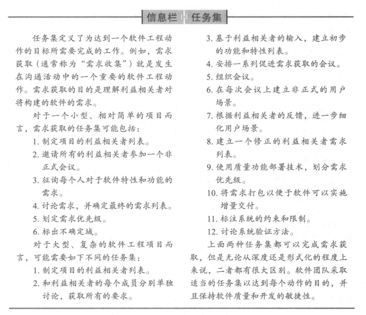
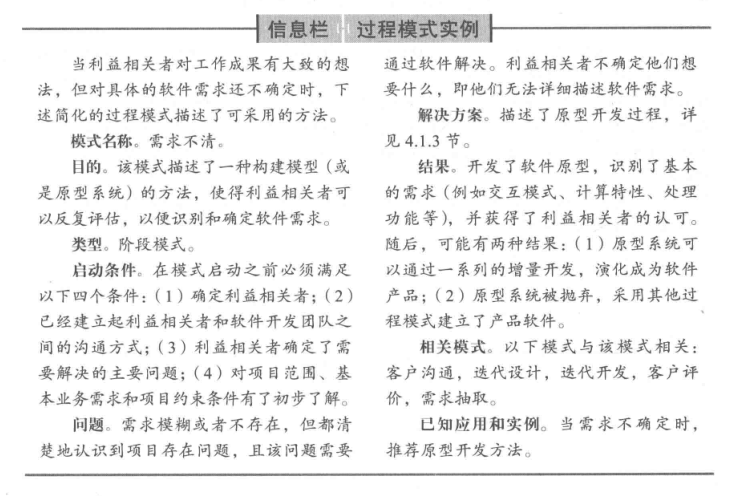
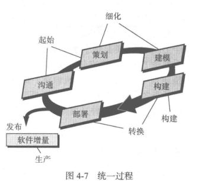
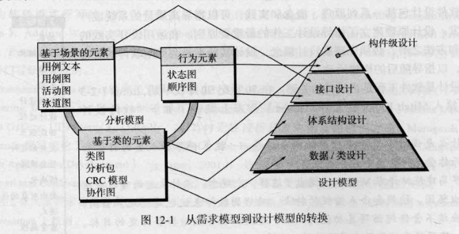
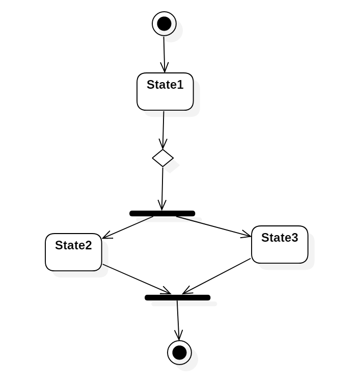
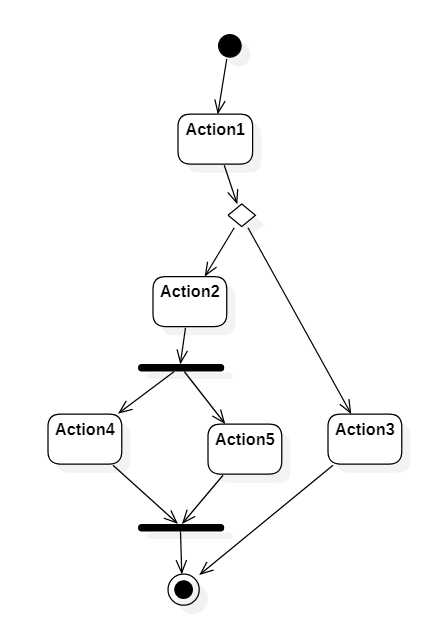
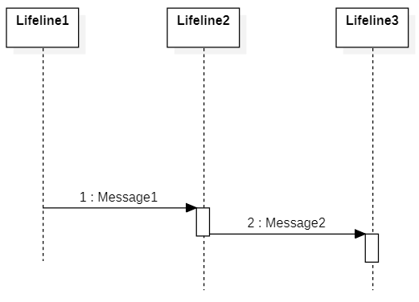
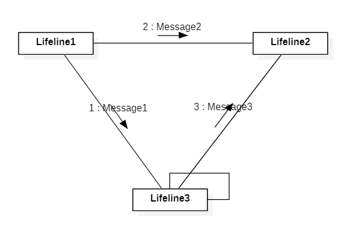
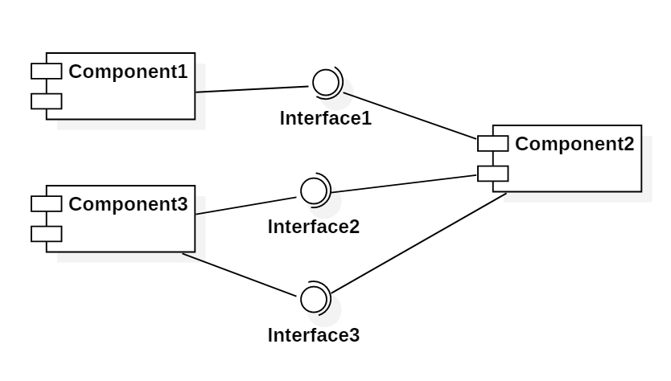
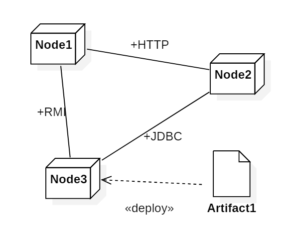

1. 软件的本质
    1. 软件的本质
        1. 定义
            1. 有很多种定义, 以书上(P3)的定义为准, 指令的集合+数据结构+软件描述信息
        2. 软件应用的领域
            1. 系统软件/应用软件/工业软件/嵌入式软件/产品线软件/Web移动应用程序/AI软件
        3. 遗留软件
            1. 挑战: 
                1. 生命周期长
                2. 质量差
                3. 原有功能质量不符合现代的要求
            2. 需要演化的情况
                1. 适应性调整, 满足新的环境/技术
                2. 升级, 实现新的商业需求
                3. 拓展, 与新的系统或数据库互操作
                4. 改建, 适应不断演化的计算环境
    2. 软件的变更本质
        1. 是生命体, 在生长
        2. 四大类占主导地位的软件
            1. WebApp/移动App/云计算/产品线软件
    3. 软件失效率曲线
        1. 理想曲线: 未知的缺陷将在软件生命周期的前期造成高失效率, 但随着错误的纠正, 曲线将趋于平缓, 软件不会磨损, 但是会退化
        2. 事实曲线: 软件会面临变更, 每次变更都会导致失效率陡然上升, 在曲线回到最初的状态前, 新的变化又会再次导致曲线上升, 最终导致最小的失效率点沿斜线的形状逐渐上升
        3. 不断的变更是导致软件失效的根本原因
    4. 云计算
       1. 应用软件: 监控/内容/协作/通信/财务
       2. 平台: 对象存储/身份/运行时/队列/数据库
       3. 基础设施: 计算/块存储/网络
2. 软件工程
    1. **软件工程的定义**
        1. 以书上为准 IEEE
            1. 将(系统化, 规范的, 可量化的)工程化方法应用于软件的开发,运行和维护
            2. 对上述方法的研究
        2. 软件工程层次
            1. 工具on方法on过程on质量关注点
            2. 过程process
                1. 包括
                    1. 活动activities
                       1. 实现宽泛的目标
                    2. 动作actions
                       1. 主要工作产品生产过程中的一系列任务
                    3. 任务tasks
                       1. 小而明确的目标, 实际产品
                2. 过程框架
                    1. **沟通/策划/建模/构建/部署**
                    2. 软件工程: 过程框架/普适性活动/框架活动i/软件工程动作i.j/任务集
            3. 方法method:
            4. 工具tool:
    2. **软件开发神话**: 为什么需要软件工程
    3. 注意思考题
3. 软件过程
    1. 通用过程框架
        1. 每个框架活动由一系列动作构成, 每个动作由任务集来定义
        2. 任务集明确了将要完成的工作任务,将要产生的工作产品,需要的质量保证点,用于表明过程状态的里程碑
    2. 过程流图
        1. 线性过程流
        2. 迭代过程流
        3. 演化过程流
        4. 并行过程流
    3. 明确任务集(细胞)
        1. 注意
    4. 过程模式
        1. 注意
        2. 模板process pattern
            1. 模式名称
            2. 驱动力
            3. 类型
                1. 步骤模式
                2. 任务模式
                3. 阶段模式
            4. 启动条件
            5. 问题
            6. 解决方案
            7. 结果
            8. 相关模式
            9. 已知应用和实例
4. 过程模型: 1,2个, 也可能简答题
    1. 分类: 传统的/敏捷的
    2. 各种模型的特点
    3. 瀑布模型是基础
        1. 沟通/策划/建模/构建/部署
    4. V模型
    5. 增量模型
        1. 特点 
            1. **第一个增量是核心产品**
    6. 螺旋模型
        1. 结合原型的选代性质和瀑布模型的可控性和系统性特点
        2. 特点
            1. 风险识别和应对
    7. UP统一过程
        1. 
5. 敏捷
    1. 定义
    2. 敏捷宣言
    3. XP
        1. 特征
            1. 保持KIS原则
            2. 鼓励使用CRC
            3. 先单元测试后代码
            4. 结对编程
            5. 重构: 以不改变其外部功能或行为而改进设计（或源代码）的内部结构。
        2. 用户故事: 描述将要开发的软件所需要的输出, 特征以及功能
    4. Scrum
        1. 特征
            1. 待定项backlog
            2. 冲刺sprint
            3. 每日站会
        2. 人员
            1. Product Owner：杜老师
            2. Scrum Master：邱博
            3. Team：三个组员
        3. 步骤
            1. 我们首先要确定一个Product Backlog（按优先顺序排列的一个产品需求列表）
            2. 团队根据product backlog做工作量的估算
            3. 通过Sprint Planning meeting，来从中挑选出一个Story作为本次迭代完成的目标，时间周期是1~4个星期，然后把这个Story进行细化，形成一个Sprint Backlog 
            4. 在Sprint backlog再细化成更小的任务，成员领取任务（2天的工作量左右）
            5. 过程中要进行每日站立会议，控制在15分钟左右，汇报昨天完成了什么，今天要做什么，遇到了哪些问题
            6. 做到每日集成，每天都可以有一个成功编译，并且可以演示的版本。
            7. 当一个Story完成，业绩就是Sprint backlog完成，表示一次Sprint的完成，这时，要进行Sprint review meeting。
            8. 最后就是Spring Retrospective Meeting，总结会议，每个人总结并讨论改进，放入到下一次Sprint的产品需求中。

6. __

7. 指导实践的原则
    1. 软件工程知识
    2. 核心原则
    3. 指导每个框架活动的原则

8. 需求工程
    1. 需求工程过程: 开始/获取/细化/协商/**规格说明(SRS)**/确认/需求管理
    2. 用例模板
       1. 用例
       2. 主/次要参与者, 使用方式
       3. 何时可用/使用频率
    3. 需求的建立(开始): 利益相关者/协同合作
    4. 收集需求(获取)
    5. 开发用例: 编写**用例规约**
    6. 构建**分析模型**: 
        1. 元素: 基于场景的元素(活动图)/基于类的元素(类图)/行为元素(状态图)
            1. 状态图: \[状态名|状态变量|状态活动\]

9.  需求建模: 基于场景
    1. 域分析: 查找或创建广泛应用的分析类或分析模式, 进行复用
        1. 输入: 技术资料/已有的应用系统/客户调查/专家建议/当前,未来需求
        2. 输出: 类的分类/复用标准/功能模型/域语言
    2. 用例图, 活动图
    3. 泳道图

10. 需求建模: 类
    1. 识别分析类, 属性, 操作
    2. 语法分析法
        1. 名词: 类/属性
        2. 动词: 操作
    3. CRC

11. 需求建模: 行为和模式
    1. 识别行为模型: 相对前面的建模是动态的
    2. 识别用例事件
    3. 状态表达: 
        1. **状态图**
        2. 顺序图(序列图)
    4. Web/移动App的需求建模
        1. 类型: 
            1. 内容模型
                1. 包含所有内容对象和分析类
                2. 
            2. 交互模型
                1. 功能, 内容和行为之间的交流
                2. 包括用例/时序图/状态图/UI原型
            3. 功能模型
            4. 导航模型
            5. 配置模型 
12. 设计
    1. 作用
         1. 产生设计模型: 数据/类设计,体系结构设计,接口设计,构建级设计
         2. 
    2. 设计概念定义
         1. 抽象/体系结构/模式/关注点分离/模块化/信息隐蔽/功能独立/逐步求精/方面/重构/OOP/设计类/依赖倒置/测试设计
    3. 设计模型
         1. xx设计元素: 数据/体系结构/接口/构建级/部署级
13. 架构级设计
    1. 软件体系结构: 系统的一个或者多个结构，它包括软件构件、构件的外部可见属性以及它们之间的相互关系。
    2. 体系结构环境图ACD
14. 构件级设计
    1. 构件
        1. 系统中模块化的, 可部署的和可替换的部件, 该部件封装了实现并对外提供一组接口
    2. 设计原则
        1. OCP/LSP/DIP/ISP/REP/CCP/CRP

## 最后一题: UML的五类图 40分

1. 用例图
2. 静态图
    1. 类图
    2. 对象图
    3. 包图
3. 行为图
    - 状态图和活动图格式完全一样, 起点用黑点, 终点是带圈黑点
    - 活动图可以带泳道
    1. 状态图
        - 仅为那些有多个状态其行为受外界环境的影响并且发生改变的类画状态图
        - 
    2. 活动图
        - 
4. 交互图
    1. 顺序图(序列图)
        - 强调时间和顺序
        - 
    2. 协作图(通讯图)
        - 强调上下级关系
        - 
5. 实现图
    1. 构件图
        - 
    2. 配置图
        - 

CMM: 一级为初始级，二级为可重复级，三级为已定义级，四级为已管理级，五级为优化级

P179 构建细化